# Arquitectura y flujo completo

Este documento explica, de punta a punta, cómo fluyen los datos por el
proyecto y qué función hace qué. El README explica *qué* es cada
submódulo y *por qué* está diseñado así (limitaciones de datos,
literatura citada, decisiones de calibración); este documento explica
*cómo* se conectan entre sí y *en qué orden* se ejecuta todo.

## 1. Mapa completo

```mermaid
flowchart TD
    subgraph ingest["1. Ingesta -- src/data_pipeline.py"]
        A1[roster_career_stats.csv]
        A2[roster_playoff_career_stats.csv]
        A3[historical_comparables_game_logs.csv]
        A4[historical_comparables_advanced_game_logs.csv]
        A5[historical_comparables_standings.csv]
        A6[team_schedule.csv]
        A7[prior_season_standings.csv]
        A8[historical_comparables_rosters.csv]
        A9[historical_comparables_player_career_stats.csv]
    end

    subgraph context["2. Capa de contexto -- src/context/"]
        B1[injury_model.py<br/>risk_score]
        B2[fatigue_accumulation.py<br/>fatigue_score]
        B3[schedule_strength.py<br/>difficulty_score]
        B4[performance_curve.py<br/>net_rating_estimate]
        B5[opponent_weighting.py<br/>weighted_net_rating]
        B6[conference_adjustment.py<br/>adjusted_net_rating]
    end

    subgraph projection["3. Proyección individual"]
        C1[aging_curve.py<br/>game_score_per36]
    end

    subgraph synergy["4. Encaje de alineación"]
        D1[lineup_synergy.py<br/>synergy_matrix]
    end

    subgraph engine["5. Motor de simulación (un equipo)"]
        E1[simulation.py<br/>run_monte_carlo]
    end

    subgraph league["6. Simulación de liga completa"]
        H1[league_simulation.py<br/>30 equipos + playoffs]
        A10[league_rosters.csv]
        A11[league_player_career_stats.csv]
    end

    subgraph validate["7. Validación"]
        F1[backtesting.py<br/>actual_percentile]
    end

    subgraph view["8. Visualización"]
        G1[webapp/ - FastAPI + JS]
    end

    A1 --> B1
    A1 --> B2
    A2 --> B2
    A1 --> C1
    A6 --> B3
    A7 --> B3
    A7 --> E1
    A3 --> B4
    A4 --> B4
    A4 --> B5
    A5 --> B5
    A5 --> B6
    B4 --> B6

    C1 --> D1
    C1 --> E1
    B1 --> E1
    B2 --> E1
    D1 --> E1

    A10 --> H1
    A11 --> H1
    C1 -. mismas funciones .-> H1
    B1 -. mismas funciones .-> H1
    B2 -. mismas funciones .-> H1
    D1 -. mismas funciones .-> H1

    A8 --> F1
    A9 --> F1
    A5 --> F1
    A4 --> F1
    C1 -. mismas funciones .-> F1
    B1 -. mismas funciones .-> F1
    B2 -. mismas funciones .-> F1
    D1 -. mismas funciones .-> F1
    E1 -. mismas funciones .-> F1

    E1 --> G1
    H1 --> G1
    F1 --> G1
    B1 --> G1
    B2 --> G1
    D1 --> G1
```



**Cómo leer esto:** las cajas 1-4 alimentan al motor de simulación de un
equipo (5). La simulación de liga completa (6) reutiliza las mismas
funciones de proyección/riesgo/sinergia (1, 2, 4), pero con los 30
rosters reales en vez de solo el del config, y un motor de partido
equipo-contra-equipo distinto (ver sección 7 del documento). El
backtesting (7) reutiliza literalmente las mismas funciones de 1-5, pero
con datos históricos reales en vez del roster/calendario hipotético del
config. La interfaz web (8, `webapp/`) no calcula nada — su capa de
datos (`dashboard/data_loader.py`) solo lee los CSV que 1-7 ya
escribieron en `data/processed/`.

## 2. Orden de ejecución de principio a fin

Esto es lo que hay que correr, en orden, para regenerar todo desde cero
(cada paso depende de los CSV que el anterior escribió):

```bash
# 1. Resolver player_id del roster (sin red, catálogo estático de nba_api)
python scripts/resolve_player_ids.py --fill-config

# 2. Ingesta completa: roster + comparables + calendario + rosters históricos
#    (8 pasos internos, ver data_pipeline.run_full_pipeline)
python src/data_pipeline.py

# 3. Capa de contexto (orden no importa entre ellos, todos leen de 2)
python -c "from src.context.injury_model import build_injury_risk_dataset; from src.config_loader import load_config; build_injury_risk_dataset(load_config())"
python -c "from src.context.fatigue_accumulation import build_fatigue_dataset; from src.config_loader import load_config; build_fatigue_dataset(load_config())"
python -c "from src.context.schedule_strength import build_schedule_difficulty_dataset; from src.config_loader import load_config; build_schedule_difficulty_dataset(load_config())"
python -c "from src.context.performance_curve import build_performance_curve_dataset; from src.config_loader import load_config; build_performance_curve_dataset(load_config())"
python -c "from src.context.opponent_weighting import build_opponent_weighting_dataset; from src.config_loader import load_config; build_opponent_weighting_dataset(load_config())"
python -c "from src.context.conference_adjustment import build_conference_adjustment_dataset; from src.config_loader import load_config; build_conference_adjustment_dataset(load_config())"

# 4. Proyección individual (depende de 2, no de 3)
python -c "from src.aging_curve import build_aging_projection_dataset; from src.config_loader import load_config; build_aging_projection_dataset(load_config())"

# 5. Sinergia de alineación (depende de 4)
python -c "from src.lineup_synergy import build_lineup_synergy_dataset; from src.config_loader import load_config; build_lineup_synergy_dataset(load_config())"

# 6. Motor de simulación (depende de 3-injury/fatigue, 4, 5, y prior_season_standings de 2)
python -c "from src.simulation import build_simulation_dataset; from src.config_loader import load_config; build_simulation_dataset(load_config())"

# 7. Backtesting (depende de 2-rosters/player_stats/standings/game_logs)
python -c "from src.backtesting import build_backtest_dataset; from src.config_loader import load_config; build_backtest_dataset(load_config())"

# --- Opcional: simulación de liga completa (30 equipos) + playoffs ---
# ADVERTENCIA: ~900 llamadas nuevas a la API, 20-30+ min la primera vez.
# 6b. Ingesta de los 30 rosters reales + career stats de ~450 jugadores
python src/data_pipeline.py --league

# 6c. Proyectar los 30 equipos, simular temporada regular + playoffs
python -c "from src.league_simulation import build_league_simulation_dataset; from src.config_loader import load_config; build_league_simulation_dataset(load_config())"

# 8. Interfaz web (lee todos los CSV anteriores, incluida la liga si existe)
uvicorn webapp.main:app --reload
```

`schedule_strength.py`, `performance_curve.py`, `opponent_weighting.py`
y `conference_adjustment.py` alimentan al **análisis y a la interfaz web**,
pero **no** al motor de simulación (5) directamente — el motor consume
`injury_model`, `fatigue_accumulation`, `aging_curve` y
`lineup_synergy`. Ver la sección 4 para el porqué.

## 3. Capa de contexto: qué produce cada submódulo

Los 6 submódulos de `src/context/` leen de los CSV de la ingesta y cada
uno escribe su propio CSV en `data/processed/`. Ninguno depende de otro
excepto `conference_adjustment.py`, que lee el resumen ya calculado por
`performance_curve.py`.

| Módulo | Función de entrada | Output (`data/processed/`) | Granularidad |
|---|---|---|---|
| `injury_model.py` | `build_injury_risk_dataset(config)` | `injury_risk.csv` | por jugador |
| `fatigue_accumulation.py` | `build_fatigue_dataset(config)` | `fatigue_risk.csv` | por jugador |
| `schedule_strength.py` | `build_schedule_difficulty_dataset(config)` | `schedule_difficulty.csv` | por partido del calendario |
| `performance_curve.py` | `build_performance_curve_dataset(config)` | `performance_curve_by_game.csv` + `performance_curve_summary.csv` | por caso histórico |
| `opponent_weighting.py` | `build_opponent_weighting_dataset(config)` | `opponent_weighting_summary.csv` | por caso histórico |
| `conference_adjustment.py` | `build_conference_adjustment_dataset(config)` | `conference_adjustment_summary.csv` | por caso histórico |

`injury_model.py` y `fatigue_accumulation.py` son los dos que
**alimentan directamente al motor de simulación** — sus outputs
(`risk_score`, `fatigue_score`) son columnas que `simulation.py` lee
directamente de `injury_risk.csv`/`fatigue_risk.csv`.

Los otros cuatro (`schedule_strength`, `performance_curve`,
`opponent_weighting`, `conference_adjustment`) sirven para **analizar y
validar los 4 `historical_comparables`** — son la base analítica del
backtesting y de la interfaz web, pero el motor hacia delante (`simulation.py`
para el roster hipotético) no los consume directamente porque:
- `schedule_strength.py` necesitaría el calendario real del equipo
  simulado, que no existe (`simulation.py` muestrea uno sintético en su
  lugar — ver sección 5).
- `performance_curve.py`/`opponent_weighting.py`/`conference_adjustment.py`
  operan sobre partidos YA jugados de los comparables históricos, no
  sobre un roster que nunca ha jugado.

## 4. Proyección individual: `aging_curve.py`

Función clave: `project_player_season(player_seasons, target_age,
minutes_per_game, games_per_season, ...)` (`src/aging_curve.py:206`).

Para cada jugador del roster, en tres pasos:

1. **`compute_per36_stats(player_seasons)`** — normaliza cada temporada
   de carrera a producción por-36-minutos (`stat / MIN * 36`), para las
   13 columnas de `GENERAL_STATS` (PTS, AST, REB, STL, BLK, TOV, OREB,
   DREB, FGM, FGA, FTM, FTA, PF) + 2 de `SHOOTING_STATS` (FG3M, FG3A).
2. **`compute_recency_weighted_baseline(...)`** — media ponderada por
   recencia (decaimiento exponencial `0.5 ** (temporadas_atrás /
   half_life)`) de las últimas `n_seasons_lookback` (3 por defecto)
   temporadas. Esto es "el nivel de talento reciente del jugador", antes
   de tocar la edad.
3. **`compute_age_adjustment_factor(current_age, target_age, curve)`** —
   multiplica la línea base por un factor según la curva de edad
   correspondiente: `DEFAULT_GENERAL_AGE_CURVE` (pico ~26-27) para la
   mayoría de stats, `DEFAULT_SHOOTING_AGE_CURVE` (pico ~30) solo para
   volumen de triples.

El resultado se escala a totales de temporada con
`minutes_per_game * games_per_season` (viene de `minutes_projection` en
`team_config.yaml`, no es algo que el modelo prediga).

Por último, **`compute_game_score_per36(per36)`** aplica el Game Score de
Hollinger (fórmula pública) sobre los valores por-36 ya ajustados por
edad, produciendo el número que el motor de simulación realmente usa:
`game_score_per36`.

```
game_score_per36 = PTS + 0.4·FGM - 0.7·FGA - 0.4·(FTA-FTM)
                    + 0.7·OREB + 0.3·DREB + STL + 0.7·AST + 0.7·BLK
                    - 0.4·PF - TOV          (todo en valores por-36)
```

`build_aging_projection_dataset(config)` orquesta esto para cada
jugador del roster y guarda `aging_curve_projection.csv`.

## 5. Sinergia de alineación: `lineup_synergy.py`

Función clave: `build_synergy_matrix(player_ids, profiles,
minutes_projection, ...)` (`src/lineup_synergy.py`).

1. **`compute_style_profile(projection_row)`** — reduce la proyección de
   cada jugador a 4 números: `usage` (FGA+0.44·FTA+TOV por-36),
   `playmaking` (AST por-36), `spacing` (FG3A por-36), `interior`
   (BLK+DREB por-36). Deriva estos de estadísticas reales, no del campo
   de texto `role_expected` del config (ver README para por qué).
2. Para cada PAREJA de jugadores del roster:
   - **`compute_usage_clash(usage_i, usage_j, threshold)`** — producto
     del exceso de uso de ambos sobre el umbral (0 si alguno está por
     debajo). Penaliza dos "ball-dominant" compartiendo cancha.
   - **`compute_playmaking_spacing_synergy(...)`** — bonus simétrico:
     creador de i × tirador de j + creador de j × tirador de i.
   - Se pondera por `pair_weight = min(minutes_i, minutes_j) / 48`.
3. Todo esto arma una matriz simétrica `(n_jugadores, n_jugadores)` con
   diagonal en 0 — el `synergy_matrix` que consume `simulation.py`.

En tiempo de simulación, **`compute_game_synergy_adjustment(available,
synergy_matrix)`** recalcula el ajuste de sinergia **partido a
partido**, usando solo a los jugadores disponibles esa noche (una forma
cuadrática vectorizada vía `np.einsum` — no hay bucles por partido pese a
simular miles de temporadas).

## 6. El motor de simulación, paso a paso

Función clave: `run_monte_carlo(...)` (`src/simulation.py:193`). Todo el
cálculo trabaja con arrays de NumPy de forma
`(n_seasons, games_per_season, n_players)` — se simulan las 10 000
temporadas a la vez, no una por una en un bucle Python.

### Paso 1 — ¿Quién está disponible cada partido? (`sample_injury_absences`)

Por jugador: se sortea cuántos partidos pierde esa temporada simulada
(binomial negativa, media = `risk_score × 82`) y se agrupan en **un solo
tramo contiguo** (una lesión real es una racha, no partidos sueltos al
azar). Con Embiid (`risk_score ≈ 0.65` en los datos reales), la media de
partidos perdidos sale a ~53 de 82.

### Paso 2 — ¿Contra quién juega y hay back-to-back? (`sample_schedule_context` o `fixed_schedule`)

Para el roster hipotético: se muestrea un rival al azar de la
distribución real de WinPCT de la liga (`prior_season_standings.csv`) y
se sortea back-to-back con probabilidad `b2b_probability` (0.18). Para
el backtesting: se usa el calendario REAL de esa temporada histórica
(`fixed_schedule`, ver `backtesting.build_real_schedule_context`).

### Paso 3 — ¿Cuánto aporta cada jugador ese partido? (`compute_player_contributions`)

```
contribución = game_score_per36 × (minutos_proyectados / 36)
               × (1 - fatigue_score × season_fatigue_decay × avance_de_temporada)
               × (1 - fatigue_score × b2b_fatigue_penalty × es_back_to_back)
               + ruido_normal(0, game_variance_std)
```
Jugadores no disponibles ese partido (Paso 1) aportan 0.

### Paso 4 — Game Score de equipo → diferencial estimado (`compute_game_net_rating_estimate`)

```
team_game_score = Σ contribuciones de jugadores disponibles
línea_base_liga = league_average_game_score_per36 × 240/36   (≈ 66.7, calibración de Hollinger)
net_rating = (team_game_score - línea_base_liga) × game_score_to_net_rating_scale
             - (opponent_win_pct - 0.5) × opponent_strength_scale
             + ajuste_de_sinergia   (si hay synergy_matrix, Paso 4.5)
```

**Por qué existe la resta de la línea base:** el Game Score de equipo
NO es un diferencial de puntos por sí solo. La primera versión de este
motor, sin esta resta, proyectaba una temporada de 81 victorias y 1
derrota — un error de calibración, no un roster bueno. Restar la línea
base de un equipo "promedio" (10 Game Score/36 min × 240 minutos de
equipo / 36) corrige esto.

### Paso 5 — ¿Victoria o derrota? (`compute_win_probabilities` + sorteo)

```
prob_victoria = 1 / (1 + exp(-net_rating / outcome_variance_scale))
resultado     = Bernoulli(prob_victoria)     # aquí está el "Monte Carlo" real
```

### Paso 6 — Agregación

`wins = Σ resultados` por temporada simulada; se repite para las 10 000
temporadas (o las que diga `simulation.n_seasons`), cada una con su
propio sorteo de lesiones/calendario/ruido — de ahí sale la
*distribución* de victorias, no un solo número.

### Ejemplo numérico concreto (datos reales del roster)

Con el roster real de los 76ers 2026-27: `team_game_score` con el
roster completo sano ronda 70-80 (10 jugadores, ~229 minutos
proyectados). Restando la línea base (~66.7) y sumando el ajuste de
sinergia (~+13 con roster sano, cerca del tope configurado de +12), el
`net_rating_estimate` medio sale ≈ **8.9** — en el mismo orden de
magnitud que los Warriors 2016-17 reales (11.39, ver
`performance_curve_summary.csv`). Las victorias medias simuladas rondan
**50.5 de 82**, más discreto que "8.9 de Net Rating" sugeriría a simple
vista porque Embiid solo se proyecta perdiendo ~53 partidos por
temporada — el riesgo de lesión real le pesa mucho al promedio.

## 7. Simulación de liga completa y playoffs: `league_simulation.py`

`simulation.py` (sección 6) enfrenta al equipo del config contra un
WinPCT genérico de rival — útil para proyectar UN equipo, pero no
responde "¿le ganaríamos a los Celtics de verdad?" ni "¿llegaríamos a las
Finales?". `league_simulation.py` es un motor DISTINTO, no una extensión
de `simulation.py`: proyecta los 30 equipos reales y los enfrenta entre
sí directamente.

**Diferencia clave en la mecánica del partido:** en `simulation.py` hace
falta restar una "línea base de equipo promedio" al Game Score (porque
se compara contra un número abstracto, no un rival real). Aquí NO hace
falta — al comparar el Game Score real del equipo A contra el del equipo
B, esa línea base se cancela:

```
diferencial      = team_game_score_A - team_game_score_B
prob_victoria_A  = 1 / (1 + exp(-diferencial / outcome_variance_scale))
```

### Ingesta: los 30 rosters reales

Nuevo, opt-in, no forma parte del pipeline normal por el coste (~900
llamadas a la API):

```bash
python src/data_pipeline.py --league
```

Corre `build_league_rosters_dataset` (`CommonTeamRoster` para las 30
franquicias, usando la tabla estática `ABBREVIATION_TO_TEAM_ID` que ya
existía en `opponent_weighting.py`) y `build_league_player_stats_dataset`
(career stats real + playoffs de ~450 jugadores, reutilizando
`fetch_player_career_stats`/`fetch_player_playoff_career_stats` que ya
existían para el roster propio).

### Proyectar un equipo cualquiera: `project_team_roster()`

Generaliza lo que `build_aging_projection_dataset` hace solo para el
roster del config, para CUALQUIER equipo:
- Misma `project_player_season` + `compute_risk_score` +
  `compute_fatigue_score` + `compute_style_profile` +
  `build_synergy_matrix` de siempre.
- Diferencia: como los otros 29 equipos no tienen un
  `minutes_projection` curado a mano, los minutos se asumen como los
  minutos/partido REALES de la temporada más reciente de cada jugador
  (continuidad de rol) — una aproximación con datos, documentada como
  tal.

### Calendario: round-robin, no el calendario oficial

`build_round_robin_schedule()` usa el método clásico del círculo de
torneos: genera rondas donde cada equipo juega exactamente una vez, y
las repite hasta sumar `games_per_season`. El calendario oficial
2026-27 no existe todavía (mismo problema que en `schedule_strength.py`)
— cuando exista, se puede sustituir sin tocar
`simulate_league_regular_season()`.

### Temporada regular: vectorizada por equipo

`simulate_league_regular_season()` calcula el Game Score de cada uno de
los 30 equipos para las N temporadas simuladas de una vez (reutilizando
`sample_injury_absences`/`compute_player_contributions` de
`simulation.py`), y solo itera en Python sobre los ~1230 partidos del
calendario (no sobre jugadores/temporadas) para acumular victorias — así
se mantiene manejable en memoria y tiempo.

### Playoffs: play-in + bracket con formato real

- `resolve_play_in()` — formato real de la NBA: 7 vs 8 (el ganador es el
  seed 7), perdedor de 7v8 vs ganador de 9v10 (por el seed 8).
- `simulate_conference_bracket()` — bracket FIJO 1v8/4v5/3v6/2v7 sin
  re-seeding entre rondas (simplificación documentada).
- `simulate_series()` — mejor-de-7, partido a partido con
  `simulate_playoff_game()`.
- Simplificaciones deliberadas en playoffs: roster a plena salud (sin
  sorteo de lesiones partido a partido) y sin back-to-backs — ver
  docstring del módulo para el porqué.

Como el seeding de playoffs depende de las victorias de ESA temporada
simulada concreta (no es fijo entre temporadas), esta parte no se puede
vectorizar igual que la temporada regular — se itera en Python sobre
`n_playoff_seasons` (config `league_simulation.n_playoff_seasons`, más
barato que el `n_seasons` de la temporada regular a propósito).

```bash
python -c "from src.league_simulation import build_league_simulation_dataset; \
from src.config_loader import load_config; \
print(build_league_simulation_dataset(load_config()))"
```

Genera `league_regular_season_summary.csv` (victorias medias de los 30
equipos), `league_playoff_summary.csv` (% de veces que cada equipo hace
playoffs / llega a cada ronda / gana el título) y
`league_player_projections.csv` (proyección individual de cada uno de
los ~450 jugadores de los 30 equipos, con las mismas stats por partido
que `aging_curve_projection.csv`) — visibles en la pestaña "Liga y
Playoffs" de la interfaz web, con un selector para navegar cualquiera de
los 30 equipos y ver su roster proyectado.

> **Bug real encontrado al correr contra los 30 equipos reales:**
> `simulate_playoffs_once` pasaba las 15 seeds completas de cada
> conferencia a `resolve_play_in()`, que exige exactamente 10 (en la
> NBA real, los seeds 11-15 quedan eliminados de la temporada regular,
> nunca entran ni al play-in). Los tests originales usaban conferencias
> de 10 equipos cada una (para que los números cuadraran fácil), lo que
> ocultó el bug — solo apareció al correr con datos reales (15 por
> conferencia). Arreglado recortando a `seeds[:10]` antes de
> `resolve_play_in`, con un test de regresión nuevo que usa 15 equipos
> por conferencia a propósito.

> **Segundo bug real, más grave, encontrado por inspección manual (no
> por un test):** los resultados no pasaban el "ojo de baloncesto" —
> Oklahoma City (núcleo top-3 de la liga) casi último del Oeste, Boston
> y los Knicks fuera de playoffs. Causa: `project_team_roster()` asigna
> a cada jugador sus minutos/partido reales de su temporada más
> reciente, pero nunca normalizaba la SUMA por equipo a los 240 minutos
> que existen de verdad en un partido (5 posiciones × 48 min). Utah
> sumaba 449 minutos "en bruto" (casi el doble de lo posible) y por eso
> lideraba título; OKC sumaba solo 262 y salía penalizado pese a tener
> el núcleo más fuerte. Arreglado con un pase en dos etapas: (1) calcular
> los minutos "en bruto" de todo el roster, (2) escalarlos para que la
> suma del equipo sea exactamente `TOTAL_TEAM_MINUTES_PER_GAME` (240,
> importado de `simulation.py`) ANTES de llamar a
> `project_player_season` — así los totales proyectados de cada jugador
> (PTS/REB/etc.) ya reflejan la asignación normalizada, no la cruda. Test
> de regresión: `test_project_team_roster_normalizes_total_minutes_to_240`.
> Lección: una anomalía que ningún test detecta pero que un conocedor del
> dominio nota al instante ("esto no tiene sentido baloncedísticamente")
> es una señal de validación tan valiosa como un test que falla — el
> conocimiento de dominio del usuario detectó esto, no el código.

## 8. Backtesting: las mismas funciones, otro roster

`src/backtesting.py` **no reimplementa nada** — llama a
`project_player_season`, `compute_risk_score`, `compute_fatigue_score`,
`build_synergy_matrix` y `run_monte_carlo`, las mismas funciones de las
secciones 4-6, pero con:

- Roster REAL de cada `historical_comparable`
  (`historical_comparables_rosters.csv`, vía `CommonTeamRoster`), no el
  hipotético de `team_config.yaml`.
- Historial de cada jugador **filtrado a temporadas anteriores** a la
  del caso (`filter_seasons_before()` — la regla de no look-ahead más
  importante del proyecto).
- Calendario REAL de esa temporada (`build_real_schedule_context()`, en
  vez de `sample_schedule_context`) — pasado a `run_monte_carlo` vía el
  parámetro `fixed_schedule`.

Al final, `run_backtest_case` compara la distribución simulada de
victorias contra las victorias REALES de esa temporada
(`(simulated_wins <= actual_wins).mean() * 100` = en qué percentil cae
lo que de verdad pasó). Ver el README para la tabla de resultados
(Warriors 2016-17 en percentil razonable, Heat/Nets/Suns en percentiles
extremos — el hallazgo central del proyecto).

## 9. Interfaz web (`webapp/`): solo lectura

`webapp/` (FastAPI + JS, única interfaz del proyecto -- ver README) no
calcula nada por sí misma: sus routers reutilizan `dashboard/data_loader.py`,
que solo lee los CSV que las secciones 1-8 ya escribieron en
`data/processed/`. Si falta un CSV, cada pestaña muestra qué comando
correr para generarlo.

- **Toggle Totales / Por partido** — `load_roster_overview()` devuelve
  TODAS las columnas (totales de temporada y por-partido a la vez);
  `select_roster_view(overview, mode, meta_columns)` elige el
  subconjunto según el toggle activo, con nombres limpios (`PTS_projected`
  → `PTS`, o las columnas `PPG`/`RPG`/... ya calculadas). La misma
  función se reutiliza para el roster propio y para cualquier equipo de
  la liga (con `meta_columns=LEAGUE_PLAYER_META_COLUMNS`, que no incluye
  `role_expected`/`unit` porque esos campos no existen para los otros 29
  equipos).
- **Leyendas** — un diccionario de glosario por pestaña
  (`ROSTER_STAT_GLOSSARY`, `SIMULATION_GLOSSARY`, `SYNERGY_GLOSSARY`,
  `BACKTEST_GLOSSARY`, `LEAGUE_GLOSSARY`) alimenta tanto los tooltips de
  columna (`st.column_config.NumberColumn(help=...)`) como un
  desplegable de texto debajo de cada tabla, vía una única función
  compartida `render_glossary_expander()` en `app.py`.
- **Navegador de equipos** — el selector en "Liga y Playoffs" filtra
  `league_player_projections.csv` por `team_abbreviation` y reutiliza
  `select_roster_view()` para mostrar el roster de cualquiera de los 30
  equipos con el mismo toggle Totales/Por-partido.
