🌐 **English** · [Español](ARQUITECTURA.es.md)

# Architecture and full flow

This document explains, end to end, how data flows through the project
and what each function does. The README explains *what* each submodule
is and *why* it's designed that way (data limitations, cited
literature, calibration decisions); this document explains *how* they
connect to each other and *in what order* everything runs.

## 1. Full map

Simplified version (8 stages, the one worth looking at first):


Full version (every intermediate CSV and what produces it, useful for
following the exact data flow):

```mermaid
flowchart TD
    subgraph ingest["1. Ingestion -- src/data_pipeline.py"]
        A1[roster_career_stats.csv]
        A2[roster_playoff_career_stats.csv]
        A3[historical_comparables_game_logs.csv]
        A4[historical_comparables_advanced_game_logs.csv]
        A5[historical_comparables_standings.csv]
        A6[team_schedule.csv]
        A7[prior_season_standings.csv]
        A8[historical_comparables_rosters.csv]
        A9[historical_comparables_player_career_stats.csv]
    end

    subgraph context["2. Context layer -- src/context/"]
        B1[injury_model.py<br/>risk_score]
        B2[fatigue_accumulation.py<br/>fatigue_score]
        B3[schedule_strength.py<br/>difficulty_score]
        B4[performance_curve.py<br/>net_rating_estimate]
        B5[opponent_weighting.py<br/>weighted_net_rating]
        B6[conference_adjustment.py<br/>adjusted_net_rating]
    end

    subgraph projection["3. Individual projection"]
        C1[aging_curve.py<br/>game_score_per36]
    end

    subgraph synergy["4. Lineup fit"]
        D1[lineup_synergy.py<br/>synergy_matrix]
    end

    subgraph engine["5. Simulation engine (one team)"]
        E1[simulation.py<br/>run_monte_carlo]
    end

    subgraph league["6. Full league simulation"]
        H1[league_simulation.py<br/>30 teams + playoffs]
        A10[league_rosters.csv]
        A11[league_player_career_stats.csv]
    end

    subgraph validate["7. Validation"]
        F1[backtesting.py<br/>actual_percentile]
    end

    subgraph view["8. Visualization"]
        G1[webapp/ - FastAPI + JS]
    end

    A1 --> B1
    A1 --> B2
    A2 --> B2
    A1 --> C1
    A6 --> B3
    A7 --> B3
    A7 --> E1
    A3 --> B4
    A4 --> B4
    A4 --> B5
    A5 --> B5
    A5 --> B6
    B4 --> B6

    C1 --> D1
    C1 --> E1
    B1 --> E1
    B2 --> E1
    D1 --> E1

    A10 --> H1
    A11 --> H1
    C1 -. same functions .-> H1
    B1 -. same functions .-> H1
    B2 -. same functions .-> H1
    D1 -. same functions .-> H1

    A8 --> F1
    A9 --> F1
    A5 --> F1
    A4 --> F1
    C1 -. same functions .-> F1
    B1 -. same functions .-> F1
    B2 -. same functions .-> F1
    D1 -. same functions .-> F1
    E1 -. same functions .-> F1

    E1 --> G1
    H1 --> G1
    F1 --> G1
    B1 --> G1
    B2 --> G1
    D1 --> G1
```



**How to read this:** boxes 1-4 feed the single-team simulation engine
(5). The full league simulation (6) reuses the same
projection/risk/synergy functions (1, 2, 4), but with the 30 real
rosters instead of just the config's, and a different team-vs-team
game engine (see section 7 of this document). Backtesting (7) reuses
literally the same functions from 1-5, but with real historical data
instead of the config's hypothetical roster/schedule. The web interface
(8, `webapp/`) doesn't compute anything — its data layer
(`dashboard/data_loader.py`) only reads the CSVs that 1-7 already wrote
to `data/processed/`.

## 2. Execution order end to end

This is what needs to run, in order, to regenerate everything from
scratch (each step depends on the CSVs the previous one wrote):

```bash
# 1. Resolve roster player_id (no network, static nba_api catalog)
python scripts/resolve_player_ids.py --fill-config

# 2. Full ingestion: roster + comparables + schedule + historical rosters
#    (8 internal steps, see data_pipeline.run_full_pipeline)
python src/data_pipeline.py

# 3. Context layer (order doesn't matter between them, all read from 2)
python -c "from src.context.injury_model import build_injury_risk_dataset; from src.config_loader import load_config; build_injury_risk_dataset(load_config())"
python -c "from src.context.fatigue_accumulation import build_fatigue_dataset; from src.config_loader import load_config; build_fatigue_dataset(load_config())"
python -c "from src.context.schedule_strength import build_schedule_difficulty_dataset; from src.config_loader import load_config; build_schedule_difficulty_dataset(load_config())"
python -c "from src.context.performance_curve import build_performance_curve_dataset; from src.config_loader import load_config; build_performance_curve_dataset(load_config())"
python -c "from src.context.opponent_weighting import build_opponent_weighting_dataset; from src.config_loader import load_config; build_opponent_weighting_dataset(load_config())"
python -c "from src.context.conference_adjustment import build_conference_adjustment_dataset; from src.config_loader import load_config; build_conference_adjustment_dataset(load_config())"

# 4. Individual projection (depends on 2, not on 3)
python -c "from src.aging_curve import build_aging_projection_dataset; from src.config_loader import load_config; build_aging_projection_dataset(load_config())"

# 5. Lineup synergy (depends on 4)
python -c "from src.lineup_synergy import build_lineup_synergy_dataset; from src.config_loader import load_config; build_lineup_synergy_dataset(load_config())"

# 6. Simulation engine (depends on 3-injury/fatigue, 4, 5, and prior_season_standings from 2)
python -c "from src.simulation import build_simulation_dataset; from src.config_loader import load_config; build_simulation_dataset(load_config())"

# 7. Backtesting (depends on 2-rosters/player_stats/standings/game_logs)
python -c "from src.backtesting import build_backtest_dataset; from src.config_loader import load_config; build_backtest_dataset(load_config())"

# --- Optional: full league simulation (30 teams) + playoffs ---
# WARNING: ~900 new API calls, 20-30+ min the first time.
# 6b. Ingest the 30 real rosters + career stats for ~450 players
python src/data_pipeline.py --league

# 6c. Project the 30 teams, simulate regular season + playoffs
python -c "from src.league_simulation import build_league_simulation_dataset; from src.config_loader import load_config; build_league_simulation_dataset(load_config())"

# 8. Web interface (reads all the CSVs above, including the league if it exists)
uvicorn webapp.main:app --reload
```

`schedule_strength.py`, `performance_curve.py`, `opponent_weighting.py`
and `conference_adjustment.py` feed **analysis and the web interface**,
but **not** the simulation engine (5) directly — the engine consumes
`injury_model`, `fatigue_accumulation`, `aging_curve`, and
`lineup_synergy`. See section 4 for why.

## 3. Context layer: what each submodule produces

The 6 `src/context/` submodules read from the ingestion CSVs and each
writes its own CSV to `data/processed/`. None depends on another except
`conference_adjustment.py`, which reads the summary already computed by
`performance_curve.py`.

| Module | Entry function | Output (`data/processed/`) | Granularity |
|---|---|---|---|
| `injury_model.py` | `build_injury_risk_dataset(config)` | `injury_risk.csv` | per player |
| `fatigue_accumulation.py` | `build_fatigue_dataset(config)` | `fatigue_risk.csv` | per player |
| `schedule_strength.py` | `build_schedule_difficulty_dataset(config)` | `schedule_difficulty.csv` | per schedule game |
| `performance_curve.py` | `build_performance_curve_dataset(config)` | `performance_curve_by_game.csv` + `performance_curve_summary.csv` | per historical case |
| `opponent_weighting.py` | `build_opponent_weighting_dataset(config)` | `opponent_weighting_summary.csv` | per historical case |
| `conference_adjustment.py` | `build_conference_adjustment_dataset(config)` | `conference_adjustment_summary.csv` | per historical case |

`injury_model.py` and `fatigue_accumulation.py` are the two that
**feed the simulation engine directly** — their outputs (`risk_score`,
`fatigue_score`) are columns `simulation.py` reads directly from
`injury_risk.csv`/`fatigue_risk.csv`.

The other four (`schedule_strength`, `performance_curve`,
`opponent_weighting`, `conference_adjustment`) serve to **analyze and
validate the 4 `historical_comparables`** — they're the analytical base
for backtesting and the web interface, but the forward engine
(`simulation.py` for the hypothetical roster) doesn't consume them
directly because:
- `schedule_strength.py` would need the simulated team's real
  schedule, which doesn't exist (`simulation.py` samples a synthetic
  one instead — see section 5).
- `performance_curve.py`/`opponent_weighting.py`/`conference_adjustment.py`
  operate on games ALREADY played by the historical comparables, not on
  a roster that has never played.

## 4. Individual projection: `aging_curve.py`

Key function: `project_player_season(player_seasons, target_age,
minutes_per_game, games_per_season, ...)` (`src/aging_curve.py:206`).

For each roster player, in three steps:

1. **`compute_per36_stats(player_seasons)`** — normalizes each career
   season to per-36-minute production (`stat / MIN * 36`), for the 13
   `GENERAL_STATS` columns (PTS, AST, REB, STL, BLK, TOV, OREB, DREB,
   FGM, FGA, FTM, FTA, PF) + 2 from `SHOOTING_STATS` (FG3M, FG3A).
2. **`compute_recency_weighted_baseline(...)`** — recency-weighted
   average (exponential decay `0.5 ** (seasons_ago / half_life)`) of
   the last `n_seasons_lookback` (3 by default) seasons. This is "the
   player's recent talent level," before touching age.
3. **`compute_age_adjustment_factor(current_age, target_age, curve)`**
   — multiplies the baseline by a factor from the corresponding age
   curve: `DEFAULT_GENERAL_AGE_CURVE` (peak ~26-27) for most stats,
   `DEFAULT_SHOOTING_AGE_CURVE` (peak ~30) only for three-point volume.

The result is scaled to season totals with `minutes_per_game *
games_per_season` (comes from `minutes_projection` in
`team_config.yaml`, not something the model predicts).

Finally, **`compute_game_score_per36(per36)`** applies Hollinger's Game
Score (public formula) over the age-adjusted per-36 values, producing
the number the simulation engine actually uses: `game_score_per36`.

```
game_score_per36 = PTS + 0.4·FGM - 0.7·FGA - 0.4·(FTA-FTM)
                    + 0.7·OREB + 0.3·DREB + STL + 0.7·AST + 0.7·BLK
                    - 0.4·PF - TOV          (all in per-36 values)
```

`build_aging_projection_dataset(config)` orchestrates this for every
roster player and saves `aging_curve_projection.csv`.

## 5. Lineup synergy: `lineup_synergy.py`

Key function: `build_synergy_matrix(player_ids, profiles,
minutes_projection, ...)` (`src/lineup_synergy.py`).

1. **`compute_style_profile(projection_row)`** — reduces each player's
   projection to 4 numbers: `usage` (FGA+0.44·FTA+TOV per-36),
   `playmaking` (AST per-36), `spacing` (FG3A per-36), `interior`
   (BLK+DREB per-36). Derives these from real stats, not from the
   config's `role_expected` text field (see the README for why).
2. For every PAIR of roster players:
   - **`compute_usage_clash(usage_i, usage_j, threshold)`** — product
     of both players' excess usage over the threshold (0 if either is
     below it). Penalizes two "ball-dominant" players sharing the
     floor.
   - **`compute_playmaking_spacing_synergy(...)`** — symmetric bonus:
     i's playmaking × j's shooting + j's playmaking × i's shooting.
   - Weighted by `pair_weight = min(minutes_i, minutes_j) / 48`.
3. All of this builds a symmetric `(n_players, n_players)` matrix with
   a 0 diagonal — the `synergy_matrix` that `simulation.py` consumes.

At simulation time, **`compute_game_synergy_adjustment(available,
synergy_matrix)`** recomputes the synergy adjustment **game by game**,
using only the players available that night (a vectorized quadratic
form via `np.einsum` — no per-game loops despite simulating thousands
of seasons).

## 6. The simulation engine, step by step

Key function: `run_monte_carlo(...)` (`src/simulation.py:193`). All the
computation works with NumPy arrays of shape
`(n_seasons, games_per_season, n_players)` — the 10,000 seasons are
simulated all at once, not one by one in a Python loop.

### Step 1 — Who's available each game? (`sample_injury_absences`)

Per player: the number of games missed that simulated season is drawn
(negative binomial, mean = `risk_score × 82`) and grouped into **one
single contiguous stretch** (a real injury is a streak, not randomly
scattered games). With Embiid (`risk_score ≈ 0.65` in real data), the
average games missed comes out to ~53 of 82.

### Step 2 — Who do they play, and is it a back-to-back? (`sample_schedule_context` or `fixed_schedule`)

For the hypothetical roster: an opponent is randomly sampled from the
league's real WinPCT distribution (`prior_season_standings.csv`) and a
back-to-back is drawn with probability `b2b_probability` (0.18). For
backtesting: the REAL schedule from that historical season is used
(`fixed_schedule`, see `backtesting.build_real_schedule_context`).

### Step 3 — How much does each player contribute that game? (`compute_player_contributions`)

```
contribution = game_score_per36 × (projected_minutes / 36)
               × (1 - fatigue_score × season_fatigue_decay × season_progress)
               × (1 - fatigue_score × b2b_fatigue_penalty × is_back_to_back)
               + normal_noise(0, game_variance_std)
```
Players unavailable that game (Step 1) contribute 0.

### Step 4 — Team Game Score → estimated differential (`compute_game_net_rating_estimate`)

```
team_game_score = Σ contributions from available players
league_baseline = league_average_game_score_per36 × 240/36   (≈ 66.7, Hollinger's calibration)
net_rating = (team_game_score - league_baseline) × game_score_to_net_rating_scale
             - (opponent_win_pct - 0.5) × opponent_strength_scale
             + synergy_adjustment   (if there's a synergy_matrix, Step 4.5)
```

**Why the baseline subtraction exists:** team Game Score is NOT a point
differential by itself. This engine's first version, without this
subtraction, projected an 81-win, 1-loss season — a calibration error,
not a good roster. Subtracting an "average" team's baseline (10 Game
Score/36 min × 240 team minutes / 36) fixes this.

### Step 5 — Win or loss? (`compute_win_probabilities` + draw)

```
win_prob = 1 / (1 + exp(-net_rating / outcome_variance_scale))
outcome  = Bernoulli(win_prob)     # this is where the actual "Monte Carlo" happens
```

### Step 6 — Aggregation

`wins = Σ outcomes` per simulated season; repeated for all 10,000
seasons (or however many `simulation.n_seasons` says), each with its
own draw of injuries/schedule/noise — that's where the win
*distribution* comes from, not a single number.

### Concrete numerical example (real roster data)

With the real 2026-27 76ers roster: `team_game_score` with the full
healthy roster is around 70-80 (10 players, ~229 projected minutes).
Subtracting the baseline (~66.7) and adding the synergy adjustment
(~+13 with a healthy roster, close to the configured +12 ceiling), the
average `net_rating_estimate` comes out to ≈ **8.9** — the same order
of magnitude as the real 2016-17 Warriors (11.39, see
`performance_curve_summary.csv`). Average simulated wins are around
**50.5 of 82**, more modest than "8.9 Net Rating" would suggest at
first glance because Embiid alone is projected to miss ~53 games per
season — real injury risk weighs heavily on the average.

## 7. Full league simulation and playoffs: `league_simulation.py`

`simulation.py` (section 6) pits the config's team against a generic
opponent WinPCT — useful for projecting ONE team, but it doesn't answer
"would we beat the real Celtics?" or "would we make the Finals?".
`league_simulation.py` is a DIFFERENT engine, not an extension of
`simulation.py`: it projects the 30 real teams and pits them against
each other directly.

**Key difference in game mechanics:** in `simulation.py` an "average
team baseline" has to be subtracted from Game Score (because it's
compared against an abstract number, not a real opponent). Here that's
NOT needed — comparing team A's real Game Score against team B's, that
baseline cancels out:

```
differential   = team_game_score_A - team_game_score_B
win_prob_A     = 1 / (1 + exp(-differential / outcome_variance_scale))
```

### Ingestion: the 30 real rosters

New, opt-in, not part of the normal pipeline due to cost (~900 API
calls):

```bash
python src/data_pipeline.py --league
```

Runs `build_league_rosters_dataset` (`CommonTeamRoster` for the 30
franchises, using the static `ABBREVIATION_TO_TEAM_ID` table that
already existed in `opponent_weighting.py`) and
`build_league_player_stats_dataset` (real career + playoff stats for
~450 players, reusing `fetch_player_career_stats`/
`fetch_player_playoff_career_stats` that already existed for the
project's own roster).

### Projecting any team: `project_team_roster()`

Generalizes what `build_aging_projection_dataset` does only for the
config's roster, for ANY team:
- The same `project_player_season` + `compute_risk_score` +
  `compute_fatigue_score` + `compute_style_profile` +
  `build_synergy_matrix` as always.
- Difference: since the other 29 teams don't have a hand-curated
  `minutes_projection`, minutes are assumed to be each player's REAL
  minutes/game from their most recent season (role continuity) — a
  data-driven approximation, documented as such.

### Schedule: round-robin, not the official schedule

`build_round_robin_schedule()` uses the classic circle-method
tournament scheduling: it generates rounds where every team plays
exactly once, and repeats them until reaching `games_per_season`. The
official 2026-27 schedule doesn't exist yet (same problem as in
`schedule_strength.py`) — once it does, it can be swapped in without
touching `simulate_league_regular_season()`.

### Regular season: vectorized per team

`simulate_league_regular_season()` computes each of the 30 teams' Game
Score for all N simulated seasons at once (reusing
`sample_injury_absences`/`compute_player_contributions` from
`simulation.py`), and only iterates in Python over the schedule's
~1230 games (not over players/seasons) to accumulate wins — this keeps
it manageable in memory and time.

### Playoffs: play-in + bracket with the real format

- `resolve_play_in()` — real NBA format: 7 vs 8 (the winner gets seed
  7), loser of 7v8 vs winner of 9v10 (for seed 8).
- `simulate_conference_bracket()` — FIXED 1v8/4v5/3v6/2v7 bracket with
  no re-seeding between rounds (documented simplification).
- `simulate_series()` — best-of-7, game by game with
  `simulate_playoff_game()`.
- Deliberate playoff simplifications: fully healthy roster (no
  per-game injury sampling) and no back-to-backs — see the module's
  docstring for why.

Since playoff seeding depends on that specific simulated season's wins
(it's not fixed across seasons), this part can't be vectorized the same
way as the regular season — it's iterated in Python over
`n_playoff_seasons` (config `league_simulation.n_playoff_seasons`,
deliberately cheaper than the regular season's `n_seasons`).

```bash
python -c "from src.league_simulation import build_league_simulation_dataset; \
from src.config_loader import load_config; \
print(build_league_simulation_dataset(load_config()))"
```

Generates `league_regular_season_summary.csv` (30 teams' average
wins), `league_playoff_summary.csv` (% of times each team makes the
playoffs / reaches each round / wins the title), and
`league_player_projections.csv` (individual projection for each of the
30 teams' ~450 players, with the same per-game stats as
`aging_curve_projection.csv`) — visible in the web interface's "Liga y
Playoffs" tab, with a selector to browse any of the 30 teams and see
their projected roster.

> **Real bug found running against the 30 real teams:**
> `simulate_playoffs_once` passed each conference's full 15 seeds to
> `resolve_play_in()`, which requires exactly 10 (in the real NBA,
> seeds 11-15 are eliminated from the regular season, they never even
> reach the play-in). The original tests used 10-team conferences each
> (so the numbers would line up easily), which hid the bug — it only
> showed up running against real data (15 per conference). Fixed by
> trimming to `seeds[:10]` before `resolve_play_in`, with a new
> regression test that deliberately uses 15 teams per conference.

> **Second real bug, more serious, found by manual inspection (not by
> a test):** the results didn't pass the "basketball eye test" —
> Oklahoma City (a top-3 core in the league) nearly last in the West,
> Boston and the Knicks out of the playoffs. Cause:
> `project_team_roster()` assigns each player their real minutes/game
> from their most recent season, but never normalized the team-level
> SUM to the 240 minutes that actually exist in a game (5 positions ×
> 48 min). Utah summed to 449 "raw" minutes (almost double what's
> possible) and so led the title odds; OKC summed to only 262 and came
> out penalized despite having the strongest core. Fixed with a
> two-stage pass: (1) compute the entire roster's "raw" minutes, (2)
> scale them so the team sum is exactly `TOTAL_TEAM_MINUTES_PER_GAME`
> (240, imported from `simulation.py`) BEFORE calling
> `project_player_season` — so each player's projected totals
> (PTS/REB/etc.) already reflect the normalized allocation, not the raw
> one. Regression test:
> `test_project_team_roster_normalizes_total_minutes_to_240`. Lesson:
> an anomaly that no test catches but that a domain expert notices
> instantly ("this makes no basketball sense") is just as valuable a
> validation signal as a failing test — the user's domain knowledge
> caught this, not the code.

## 8. Backtesting: the same functions, a different roster

`src/backtesting.py` **doesn't reimplement anything** — it calls
`project_player_season`, `compute_risk_score`, `compute_fatigue_score`,
`build_synergy_matrix`, and `run_monte_carlo`, the same functions from
sections 4-6, but with:

- Each `historical_comparable`'s REAL roster
  (`historical_comparables_rosters.csv`, via `CommonTeamRoster`), not
  `team_config.yaml`'s hypothetical one.
- Each player's history **filtered to seasons before** the case's
  season (`filter_seasons_before()` — the project's most important
  no-look-ahead rule).
- That season's REAL schedule (`build_real_schedule_context()`, instead
  of `sample_schedule_context`) — passed to `run_monte_carlo` via the
  `fixed_schedule` parameter.

At the end, `run_backtest_case` compares the simulated win distribution
against that season's REAL wins (`(simulated_wins <= actual_wins).mean()
* 100` = which percentile of the simulated distribution the real
outcome falls in). See the README for the results table (2016-17
Warriors at a reasonable percentile, Heat/Nets/Suns at extreme
percentiles — the project's central finding).

## 9. Web interface (`webapp/`): read-only

`webapp/` (FastAPI + JS, the project's only interface — see the README)
doesn't compute anything itself: its routers reuse
`dashboard/data_loader.py`, which only reads the CSVs sections 1-8
already wrote to `data/processed/`. If a CSV is missing, each tab shows
which command to run to generate it.

- **Totals / Per-game toggle** — `load_roster_overview()` returns ALL
  columns (season totals and per-game at once);
  `select_roster_view(overview, mode, meta_columns)` picks the subset
  for the active toggle, with clean names (`PTS_projected` → `PTS`, or
  the already-computed `PPG`/`RPG`/... columns). The same function is
  reused for the project's own roster and for any team in the league
  (with `meta_columns=LEAGUE_PLAYER_META_COLUMNS`, which doesn't
  include `role_expected`/`unit` since those fields don't exist for the
  other 29 teams).
- **Glossaries** — a per-tab glossary dictionary
  (`ROSTER_STAT_GLOSSARY`, `SIMULATION_GLOSSARY`, `SYNERGY_GLOSSARY`,
  `BACKTEST_GLOSSARY`, `LEAGUE_GLOSSARY`) feeds both the column
  tooltips (`st.column_config.NumberColumn(help=...)`) and a text
  expander below each table, via a single shared
  `render_glossary_expander()` function in `app.py`.
- **Team browser** — the selector in "Liga y Playoffs" filters
  `league_player_projections.csv` by `team_abbreviation` and reuses
  `select_roster_view()` to show any of the 30 teams' roster with the
  same Totals/Per-game toggle.