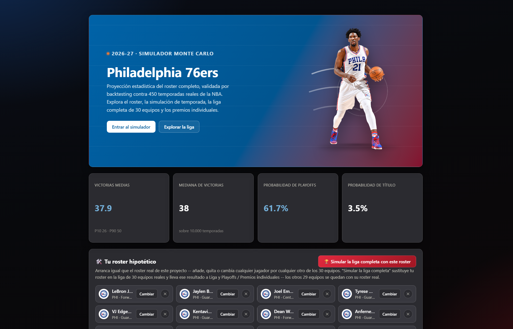
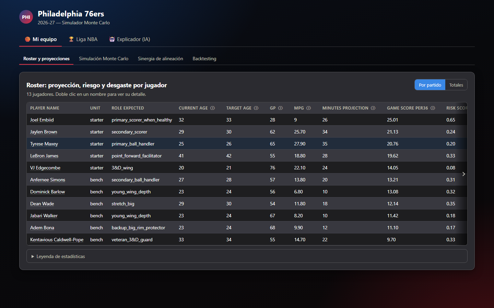
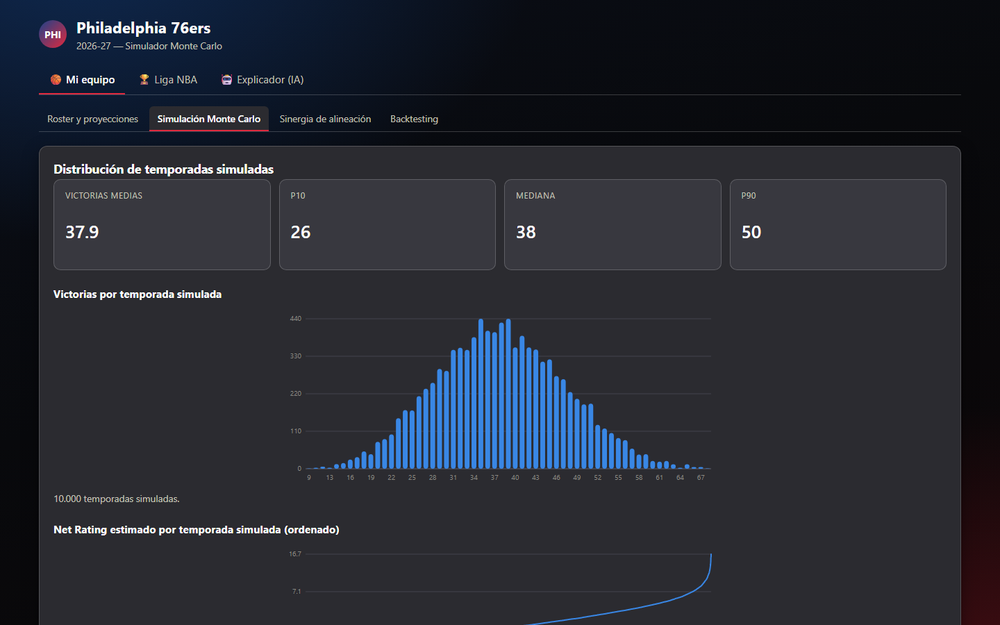
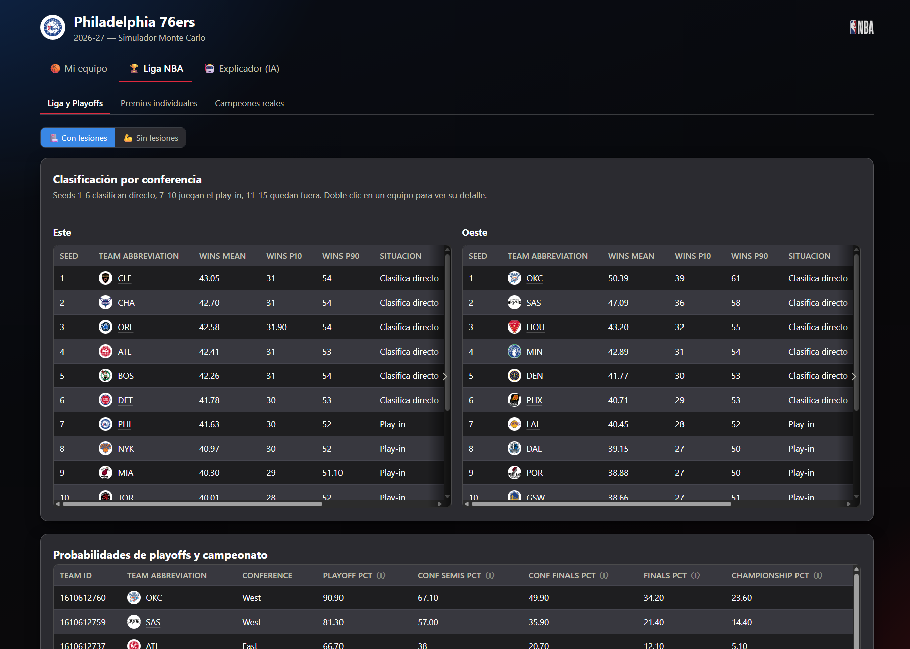
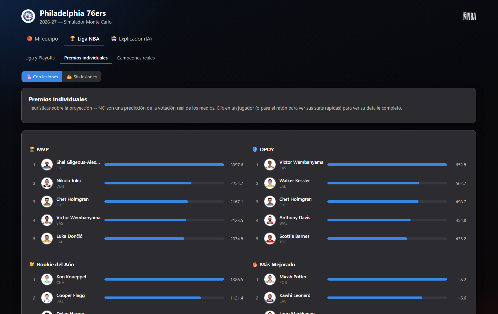
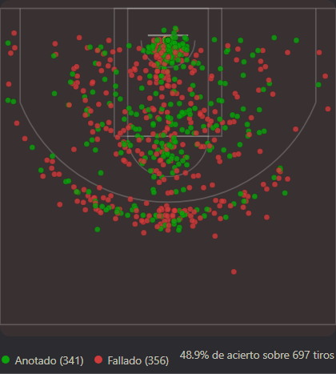
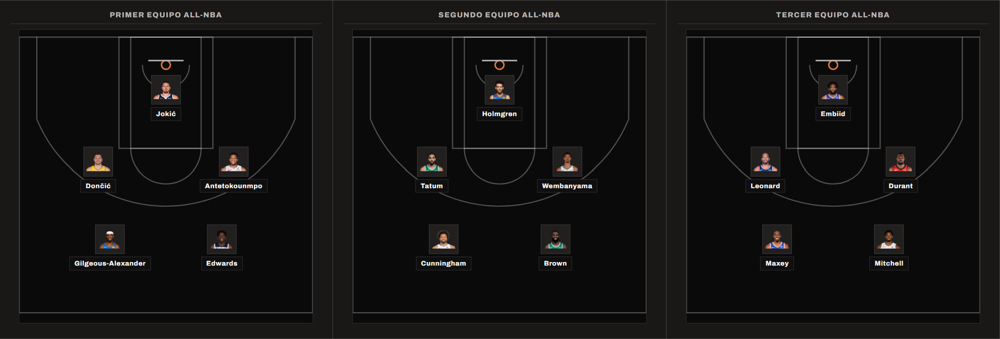
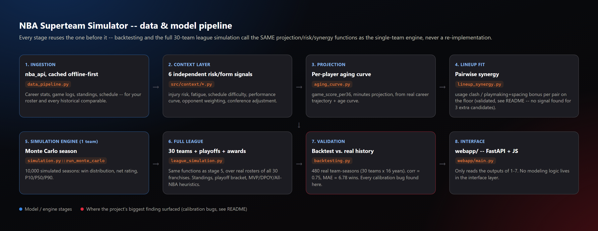

🌐 [English](README.md) · **Español**

# NBA Superteam Simulator

Simulación Monte Carlo del rendimiento esperado de un equipo NBA que
incorpora múltiples jugadores de alto usage, validada por backtesting
contra casos históricos comparables (Heat 2010-11, Warriors 2016-17,
Nets 2020-21, Suns 2022-23).

**Diseñado para ser 100% reproducible con cualquier equipo**: todo lo
específico del roster vive en `config/team_config.yaml`, nunca en el
código.

[](https://github.com/nachofrancoalm-dot/NBA-26-27-season-simulation/actions/workflows/tests.yml)


🔗 **Demo en vivo:** [nba-superteam-sim.onrender.com](https://nba-superteam-sim.onrender.com) (plan gratuito — la primera carga puede tardar ~30-60s si estaba inactivo) · 📄 [Recorrido completo de la arquitectura](ARQUITECTURA.es.md)

## Qué es esto

Un motor de simulación Monte Carlo que proyecta cómo rendiría un roster
de la NBA —incluidos rosters hipotéticos que tú mismo construyes— a lo
largo de una temporada completa y playoffs: proyecciones individuales
de jugador (curvas de edad, riesgo de lesión, fatiga), sinergia de
alineación, simulación completa de temporada regular + playoffs de los
30 equipos, y premios estilo MVP/DPOY/All-NBA, todo servido a través de
una interfaz web propia (FastAPI + JS vanilla).

Lo que hace que esto sea más que un juguete estadístico es la
disciplina de validación detrás: cada suposición del modelo se
contrasta con datos históricos reales antes de darla por buena, y **las
suposiciones que no aguantan se documentan y se descartan, no se
mantienen en silencio**. Algunos ejemplos concretos:

- **Calibrado contra 480 casos reales de temporada completa** (30
  equipos × 16 temporadas, vía `nba_api`), no a ojo. El total de
  victorias proyectado correlaciona **0.75** con las victorias reales,
  MAE de **6.78 victorias/temporada** — bajando desde un MAE inicial de
  13.2 victorias antes de encontrar y corregir dos bugs de calibración
  (ver la sección "Backtesting" más abajo).
- **Se investigó si un bonus de "sinergia de alineación" (choque de
  uso, creador + espaciador, y tres candidatos más: anotador de poste +
  creador, tirador con/sin balón, penetrador + presencia interior)
  predice de verdad el net rating real de una pareja sobre la
  cancha.** Se probaron los 5 contra datos reales de
  `leaguedashlineups`/tracking con validación leave-one-season-out.
  Resultado: ninguno aguanta (R² ≈ 0.02, signo equivocado en la mayoría
  de los pliegues) — se reportó como resultado negativo en vez de
  forzarlo dentro del modelo.
- **Se investigó el efecto "año de contrato"** (¿los jugadores rinden
  estadísticamente más en el último año de su contrato?) con datos
  reales de salario/contrato. Una comparación pareada + regresión de
  efectos fijos por jugador sobre 126 contratos no encontró efecto
  medible (coeficiente ≈ 0, p = 0.89) — no se incorporó al modelo.
- **Se encontró y corrigió un bug real gracias a una inconsistencia
  reportada por el usuario**: una simulación de roster hipotético
  reportaba 26 victorias medias por un camino de código y 42 por otro,
  para el *mismo* roster — rastreado hasta una línea base de sinergia
  inconsistente entre los dos modos de simulación.

Cada una de estas investigaciones vive en el repo como un script
ejecutable y testeado (`scripts/experiments/`) más un relato escrito
del resultado — incluidas las que salieron negativas. Tres de ellas
tienen además un notebook curado y visual: [`notebooks/`](notebooks/).

**Capturas** (interfaz web, `webapp/`):

| Splash | Roster y proyecciones |
|---|---|
|  |  |

| Distribución Monte Carlo | Clasificación de liga y probabilidades de playoffs |
|---|---|
|  |  |

| Premios individuales | Mapa de tiros real (popup de detalle de jugador) |
|---|---|
|  |  |

**Quintetos All-NBA / All-Defensive sobre una media cancha real** — cada
quinteto de 5 dibujado con fotos reales de jugador en el formato
clásico 2-2-1 (`webapp/static/js/court.js::courtLineup`), sin tabla
alguna: clic en un jugador (o pasa el ratón para ver una stat rápida)
para abrir su perfil completo. MVP/DPOY/ROY/MIP/6.º Hombre también
dejaron sus tablas, a favor de un ranking visual (`leaderboard.js`) —
ver la captura de premios arriba.



**Pipeline:** cada etapa de abajo reutiliza la anterior — la simulación
completa de los 30 equipos y el backtesting llaman a las *mismas*
funciones de proyección/riesgo/sinergia que el motor de un solo equipo,
nunca una reimplementación. Diagrama completo (todos los archivos
intermedios): [`ARQUITECTURA.es.md`](ARQUITECTURA.es.md).



**Stack:** Python (pandas, numpy, scipy, statsmodels/scikit-learn) para
el modelado · `nba_api` para datos reales · FastAPI + JS vanilla para
la interfaz web · pytest (465 tests) + GitHub Actions CI.

---

> **¿Primera vez en el proyecto?** Este README explica *qué* es cada
> pieza y *por qué* está diseñada así. Para el flujo completo de punta a
> punta — diagrama, orden exacto de comandos, y cómo se simula un
> partido paso a paso con las funciones concretas — ver
> [`ARQUITECTURA.es.md`](ARQUITECTURA.es.md).

## Estado actual

- [x] Estructura del proyecto
- [x] Config-driven design (`team_config.yaml`), roster completo (titulares + banquillo)
- [x] Resolución automática de `player_id` sin red (`scripts/resolve_player_ids.py`)
- [x] Pipeline de ingesta de datos (`src/data_pipeline.py`) vía `nba_api`, offline-first con caché local (temporada regular + playoffs)
- [x] Capa de contexto de temporada — los 6 submódulos del roadmap implementados y validados contra datos reales (ver detalle abajo)
- [x] Modelo de aging curve / proyección individual (`src/aging_curve.py`) — ver detalle abajo
- [x] Modelo de sinergia de alineación (`src/lineup_synergy.py`) — ver detalle abajo
- [x] Motor de simulación Monte Carlo (`src/simulation.py`) — ver detalle abajo
- [x] Backtesting contra comparables históricos (`src/backtesting.py`) — ver detalle abajo
- [x] Frontend web propio (`webapp/`, FastAPI + HTML/CSS/JS) — única interfaz del proyecto, ver detalle abajo
- [x] Simulación de liga completa (30 equipos reales) + playoffs (`src/league_simulation.py`) — ver detalle abajo

## Roadmap: capa de contexto de temporada (`src/context/`)

Un modelo que solo mira medias de carrera es estadísticamente ingenuo.
Estos sub-módulos se añaden progresivamente, cada uno independiente y
testeable por separado:

1. **`schedule_strength.py`** ✅ — `difficulty_score` (0-1) por partido
   del calendario (no por jugador, a diferencia de los demás submódulos):
   fuerza del rival, back-to-backs y viaje. Ver detalle más abajo.
2. **`performance_curve.py`** ✅ — Net Rating estimado en ventanas
   móviles sobre los comparables históricos (temporada regular +
   playoffs), para detectar arranques lentos de integración y picos de
   forma en playoffs. Ver detalle más abajo.
3. **`injury_model.py`** ✅ — risk_score (0-1) de lesión por jugador,
   combinando historial de carga de partidos perdidos, un componente de
   recencia (una ausencia reciente pesa más que una antigua, decaimiento
   exponencial configurable) y una curva de riesgo por edad. Ver detalle
   más abajo.
4. **`fatigue_accumulation.py`** ✅ — fatigue_score (0-1) por desgaste
   acumulado de minutos: carrera longeva, uso pesado reciente y rachas de
   temporadas consecutivas sin descanso. Combina temporada regular y
   playoffs (relevante sobre todo para LeBron, 41 años). Ver detalle más
   abajo.
5. **`opponent_weighting.py`** ✅ — pondera partidos contra contenders/
   rivales directos más que partidos contra equipos en reconstrucción,
   para el backtesting. Ver detalle más abajo.
6. **`conference_adjustment.py`** ✅ — normaliza fuerza relativa
   Este/Oeste por temporada antes de comparar récords entre comparables
   históricos. Ver detalle más abajo.

### `injury_model.py` — detalle

Calcula, para cada jugador del roster, un `risk_score` entre 0 y 1 a
partir de `data/processed/roster_career_stats.csv` (generado por
`data_pipeline.py`). No usa datos de lesión reales porque `nba_api` no
los expone (`CommonPlayerInfo` solo trae datos biográficos) — en su
lugar usa como proxy la disponibilidad histórica: partidos jugados (GP)
frente a partidos de calendario esa temporada (con excepciones
conocidas: 66 partidos en el lockout de 2011-12, ~72 en las temporadas
de COVID 2019-20/2020-21).

El score combina tres componentes, con pesos configurables en
`config/team_config.yaml` (bloque `injury_model`), nunca hardcodeados:

| Componente | Peso por defecto | Qué mide |
|---|---|---|
| `historical_load_score` | 0.45 | % medio de partidos perdidos en las últimas N temporadas |
| `recency_score` | 0.35 | Lo mismo, pero ponderado con decaimiento exponencial: una ausencia reciente pesa más que una antigua |
| `age_score` | 0.20 | Curva de riesgo por edad — sube y se aplana, no crece sin límite |

El peso de edad es deliberadamente bajo frente al historial (0.80 entre
los otros dos componentes): la evidencia epidemiológica ([Ruddy et al.,
PMC6176657](https://www.ncbi.nlm.nih.gov/pmc/articles/PMC6176657/))
señala el historial de lesiones reciente como el predictor individual
más fuerte de una lesión futura, más que la edad en abstracto. Además,
la curva de edad se aplana (no decrece, pero tampoco sigue subiendo) a
partir de `peak_start_age` (32 por defecto), reflejando el sesgo de
supervivencia documentado en veteranos de carreras muy largas ([Mack et
al., PMC11569584](https://pmc.ncbi.nlm.nih.gov/articles/PMC11569584/)):
un jugador de 41 años con historial reciente limpio (el caso de LeBron
James) no recibe un `risk_score` inflado solo por su edad.

```bash
python -c "from src.context.injury_model import build_injury_risk_dataset; \
from src.config_loader import load_config; \
print(build_injury_risk_dataset(load_config()))"
```

Genera `data/processed/injury_risk.csv`. Requiere que
`roster_career_stats.csv` ya exista (correr `data_pipeline.py` primero).
Tests en `tests/test_injury_model.py` — no requieren red, usan DataFrames
sintéticos con el esquema de `roster_career_stats.csv`.

> **Nota de corrección de datos:** cuando un jugador es traspasado a
> mitad de temporada, `nba_api` incluye una fila `TOT` (total) además de
> una fila por cada equipo, todas con la misma temporada. `injury_model.py`
> (y `fatigue_accumulation.py`) hacen dedupe de esto priorizando la fila
> `TOT` — sin ese paso, una temporada con trade se contaría dos o más
> veces en la ventana de N temporadas.

### `fatigue_accumulation.py` — detalle

Calcula, para cada jugador, un `fatigue_score` entre 0 y 1 a partir de
`roster_career_stats.csv` (temporada regular) y
`roster_playoff_career_stats.csv` (playoffs) — ambos generados por
`data_pipeline.py`. A diferencia de `injury_model.py` (que mide riesgo a
partir de partidos *perdidos*), este mide desgaste acumulado por partidos
*jugados* con carga alta de minutos.

| Componente | Peso por defecto | Qué mide |
|---|---|---|
| `cumulative_load_score` | 0.35 | Minutos totales de carrera (regular + playoffs) frente a un tope configurable de "carrera longeva" (35 000 min por defecto) |
| `recent_intensity_score` | 0.35 | Minutos/partido en las últimas N temporadas frente a un umbral de "uso pesado" (34 min/partido por defecto), ponderado por recencia |
| `sustained_streak_score` | 0.30 | Nº de temporadas recientes consecutivas sin una caída de carga (sin temporada de descanso/descarga), con retornos decrecientes |

A propósito **no tiene un componente de edad explícito**: el desgaste por
carrera larga ya emerge de forma natural en `cumulative_load_score` (más
años en la liga = más minutos acumulados), así que añadir edad aparte
duplicaría esa señal — a diferencia de `injury_model.py`, donde el
historial de lesiones y la edad sí son señales genuinamente distintas.

A diferencia de `injury_model.py`, aquí no hay literatura publicada que
justifique una jerarquía clara entre los tres componentes, así que los
pesos por defecto son similares entre sí (todos configurables en
`config/team_config.yaml`, bloque `fatigue_model`).

```bash
python -c "from src.context.fatigue_accumulation import build_fatigue_dataset; \
from src.config_loader import load_config; \
print(build_fatigue_dataset(load_config()))"
```

Genera `data/processed/fatigue_risk.csv`. Requiere
`roster_career_stats.csv` (y opcionalmente `roster_playoff_career_stats.csv`
— si no existe, el fatigue_score se calcula solo con temporada regular).
Tests en `tests/test_fatigue_accumulation.py` — no requieren red.

**Resultado sobre el roster real (2026-27):** LeBron James encabeza el
`fatigue_score` (0.89, el más alto del equipo) por su altísimo
`cumulative_load_score` — pero en `injury_model.py` su `risk_score` es
solo moderado (0.33, empatado con Kentavious Caldwell-Pope). Es
exactamente el comportamiento buscado: dos submódulos midiendo cosas
distintas pueden dar lecturas opuestas para el mismo jugador — mucho
desgaste acumulado, pero poco riesgo de lesión reciente.

### `schedule_strength.py` — detalle

A diferencia de `injury_model.py` y `fatigue_accumulation.py`, este
submódulo **no es por jugador** — calcula un `difficulty_score` (0-1)
**por partido** del calendario del equipo, a partir de
`team_schedule.csv` y `prior_season_standings.csv` (ambos generados por
`data_pipeline.py`).

| Componente | Peso por defecto | Qué mide |
|---|---|---|
| `opponent_strength_score` | 0.40 | WinPCT del rival en la temporada **anterior** (ya en escala 0-1) |
| `back_to_back_score` | 0.30 | 1.0 si el partido anterior del equipo fue el día previo, si no 0.0 |
| `travel_score` | 0.30 | Distancia (haversine) desde la ciudad del partido anterior, normalizada contra un tope de "viaje largo" (3000 km por defecto) |

**Dos limitaciones de datos importantes, documentadas también en el
docstring del módulo:**

1. **Fuerza del rival vía temporada anterior.** `team_config.yaml` puede
   apuntar a una temporada que aún no se jugó (2026-27) — no existen
   resultados reales de esa temporada para medir la fuerza de cada rival.
   Se usa el WinPCT de la temporada anterior como proxy, igual que
   cualquier preview de calendario real.
2. **Viaje vía tabla estática de coordenadas.** `nba_api` no expone
   distancias entre ciudades. `ARENA_COORDS` en el módulo tiene
   coordenadas aproximadas de las 30 ciudades de franquicias NBA (un
   hecho geográfico de la liga, no algo específico de este equipo) y
   calcula distancia geodésica (haversine) entre partidos consecutivos.
   Partidos en sede neutral fuera de esas 30 ciudades (México, Londres,
   París) no tienen coordenada — ese tramo de viaje se trata como 0 km y
   se avisa por consola, en vez de fallar.

```bash
python -c "from src.context.schedule_strength import build_schedule_difficulty_dataset; \
from src.config_loader import load_config; \
print(build_schedule_difficulty_dataset(load_config()))"
```

Genera `data/processed/schedule_difficulty.csv`. Requiere
`team_schedule.csv` y `prior_season_standings.csv` (correr
`data_pipeline.py` primero). Tests en `tests/test_schedule_strength.py`
— no requieren red.

> **Nota sobre disponibilidad real de datos:** al probar esto contra la
> API real en agosto de 2026, el calendario 2026-27 de `ScheduleLeagueV2`
> solo devolvió 2 partidos (ambos de pretemporada) — la NBA todavía no
> había publicado el calendario completo de temporada regular. Esto es
> un estado real y esperable, no un bug: en cuanto la liga publique el
> calendario completo, `python src/data_pipeline.py --refresh` lo
> recogerá.

### `performance_curve.py` — detalle

Opera sobre los `historical_comparables` (Heat 2010-11, Warriors 2016-17,
Nets 2020-21, Suns 2022-23) — no sobre el roster simulado. Estima Net
Rating por partido y calcula una media móvil configurable para detectar
si un "superequipo" arranca lento (tarda en integrarse) y si mejora en
playoffs, que es la narrativa central que el proyecto busca validar por
backtesting.

**Aproximación de datos:** NBA.com no expone Net Rating oficial por
partido individual sin llamadas adicionales. Se estima como:

```
net_rating_estimate = PLUS_MINUS / posesiones_estimadas * 100
posesiones_estimadas ≈ FGA - OREB + TOV + 0.44 * FTA   (fórmula estándar de analítica de básquet)
```

`PLUS_MINUS` viene de `TeamGameLogs` (endpoint **plural**, con
`PLUS_MINUS`) — distinto de `TeamGameLog` (singular, sin `PLUS_MINUS`,
el que ya usaba `historical_comparables_game_logs.csv`). Por eso
`data_pipeline.py` genera un CSV nuevo y separado,
`historical_comparables_advanced_game_logs.csv`, en vez de tocar el
existente.

```bash
python -c "from src.context.performance_curve import build_performance_curve_dataset; \
from src.config_loader import load_config; \
print(build_performance_curve_dataset(load_config())['summary'])"
```

Genera `data/processed/performance_curve_by_game.csv` (serie completa) y
`data/processed/performance_curve_summary.csv` (un resumen por caso:
`early_season_net_rating`, `playoff_boost`, `trend_slope`, etc.). Tests
en `tests/test_performance_curve.py` — no requieren red.

**Resultado sobre los 4 casos reales:** los Suns 2022-23 muestran
`playoff_boost = -4.36` (colapsaron en playoffs — barridos en segunda
ronda en la realidad) mientras que los Warriors 2016-17 muestran
`playoff_boost = +1.62` (subieron de nivel en playoffs — campeones ese
año). El modelo, con datos reales, reproduce direccionalmente narrativas
conocidas de esos dos casos históricos.

### `opponent_weighting.py` — detalle

Complementa a `performance_curve.py`: pondera cada partido de un
comparable histórico por la fuerza REAL de su rival **esa misma
temporada** (no un proxy de temporada anterior — a diferencia de
`schedule_strength.py`, estas 4 temporadas ya se jugaron por completo, así
que se puede pedir la fuerza contemporánea real vía
`historical_comparables_standings.csv`).

- El rival se resuelve desde la columna `MATCHUP` ("MIA @ TOR") con una
  tabla estática de las 30 franquicias NBA, más alias para abreviaciones
  históricas que cambiaron dentro del rango de temporadas del proyecto
  (Nets "NJN" antes de mudarse a Brooklyn en 2012-13; Hornets/Pelicans
  "NOH" antes del cambio de nombre en 2013-14).
- El peso numérico es **continuo** (`win_pct ** steepness`), no un umbral
  fijo — un rival con 0.54 de WinPCT no es cualitativamente distinto de
  uno con 0.56, así que cualquier corte binario sería arbitrario. Sí
  ofrece además una vista categórica descriptiva
  (contender/medio/reconstrucción, con umbrales configurables) porque el
  roadmap la pide como resumen legible.
- Reutiliza `compute_net_rating_estimate()` de `performance_curve.py` por
  import directo, en vez de duplicar la fórmula.

```bash
python -c "from src.context.opponent_weighting import build_opponent_weighting_dataset; \
from src.config_loader import load_config; \
print(build_opponent_weighting_dataset(load_config()))"
```

Genera `data/processed/opponent_weighting_summary.csv`. Requiere
`historical_comparables_advanced_game_logs.csv` y
`historical_comparables_standings.csv` (correr `data_pipeline.py`
primero). Tests en `tests/test_opponent_weighting.py` — no requieren red.

**Resultado sobre los 4 casos reales:** los Suns 2022-23 tienen
`contender_net_rating = -5.35` — **perdían en promedio contra rivales
fuertes** — mientras aplastaban a equipos en reconstrucción
(`reconstruccion_net_rating = +6.62`). Su Net Rating general (1.55) se
veía inflado por partidos fáciles; contra competencia real, el equipo era
netamente negativo. Coincide con su colapso real en playoffs. Los Heat
2010-11 muestran un patrón similar en menor grado (1.47 vs. contenders,
13.17 vs. equipos débiles) — consistente con la narrativa real de un
"superequipo" que tardó en integrarse contra rivales de su nivel.

### `conference_adjustment.py` — detalle

Cierra el roadmap de `src/context/`. Normaliza WinPCT y Net Rating de
cada comparable histórico por la fuerza relativa Este/Oeste esa
temporada, para poder comparar entre sí casos que jugaron en
conferencias y temporadas distintas.

**Fundamento estadístico (sin necesidad de datos adicionales):** tanto
el WinPCT como el diferencial de puntos (`DiffPointsPG`) son de suma
cero a nivel de LIGA completa (30 equipos) por construcción — pero NO
por separado dentro de cada conferencia, porque los partidos
inter-conferencia no son de suma cero dentro de un solo grupo. Si el
Oeste le gana más partidos de los que pierde al Este esa temporada, el
WinPCT/DiffPointsPG medio del Oeste sube por encima de la línea base
(0.5 / 0) y el del Este baja en la misma magnitud. Esa desviación de la
media de conferencia **es** el índice de fuerza relativa esa temporada.

```
conference_index = media(métrica de todos los equipos de esa conferencia esa temporada) - línea_base
valor_ajustado    = valor_bruto_del_equipo - conference_index
```

Jugar en una conferencia con índice positivo (más dura) resta menos (o
suma) al valor ajustado; jugar en una conferencia floja resta más — da
crédito por el contexto.

```bash
python -c "from src.context.conference_adjustment import build_conference_adjustment_dataset; \
from src.config_loader import load_config; \
print(build_conference_adjustment_dataset(load_config()))"
```

Genera `data/processed/conference_adjustment_summary.csv`. A diferencia
de `opponent_weighting.py` (que recalcula su propia métrica por partido
para mantenerse autocontenido), este módulo **sí depende** del resumen
ya agregado de `performance_curve.py` — comparar resúmenes entre casos es
exactamente su propósito, no tiene sentido recalcular la serie completa
de partidos otra vez. Requiere `historical_comparables_standings.csv` y
`performance_curve_summary.csv` (correr `data_pipeline.py` y
`performance_curve.py` primero). Tests en
`tests/test_conference_adjustment.py` — no requieren red.

**Resultado sobre los 4 casos reales:** el Este tuvo índice negativo en
2010-11 (-0.75) y 2020-21 (-0.35) — el Oeste dominaba el cruce
inter-conferencia esos años, consistente con la narrativa real de esas
temporadas. Por eso el Net Rating de los Heat 2010-11 se ajusta HACIA
ARRIBA (8.05 → 8.80) y el de los Nets 2020-21 también (4.43 → 4.78) —
crédito por competir en un contexto más duro. Los Warriors 2016-17, en
cambio, jugaban en un Oeste dominante (+0.77) y su Net Rating se ajusta
levemente hacia abajo (11.39 → 10.62).

## Modelo de aging curve / proyección individual (`src/aging_curve.py`)

Fuera de `src/context/` — no es parte del roadmap de contexto de
temporada, es la otra pieza pendiente de "Estado actual". Proyecta la
producción por-36-minutos de cada jugador del roster para la temporada
del config, combinando:

1. **Línea base** — media ponderada por recencia (decaimiento
   exponencial, mismo patrón que `injury_model.py`) de las últimas N
   temporadas por-36 del propio jugador.
2. **Ajuste por edad** — un factor multiplicativo según DOS curvas
   distintas, no una sola:
   - **Curva general** (PTS, AST, REB, STL, BLK, TOV) — pico ~26-27 años.
   - **Curva de tiro** (volumen de triples: FG3M, FG3A) — pico ~30 años,
     porque el tiro exterior envejece mejor que el resto del juego.

**Por qué dos curvas y de dónde salen los puntos de quiebre:** no hay
suficientes datos propios en este proyecto (solo 10 jugadores) para
ajustar una curva de edad poblacional con rigor estadístico — eso
requeriría carreras completas de cientos de jugadores históricos, fuera
del alcance de `data_pipeline.py` actual. En su lugar, la UBICACIÓN de
los puntos de quiebre viene de investigación pública: el rendimiento
medio sube más rápido entre 19-20 y 23-25 años, baja más rápido entre
29-31 y 36-38, con pico general ~26-27; los tiros de 2/tiro libre pican
~25 seguido de declive marcado, mientras el triple pica más tarde, ~30
([Large data and Bayesian modeling — aging curves of NBA players,
PubMed 30684225](https://pubmed.ncbi.nlm.nih.gov/30684225/)). Las
MAGNITUDES exactas del cambio anual en cada tramo sí son una estimación
de este proyecto calibrada para esa forma — no vienen literalmente de un
paper — y están expuestas como config (`config["aging_curve"]`), no
hardcodeadas, precisamente porque son una estimación.

**Reutiliza config existente en vez de inventar campos nuevos:** escala
la proyección por-36 a totales de temporada usando el `minutes_projection`
que cada jugador ya tiene en el `roster` de `team_config.yaml`, y
`simulation.games_per_season`.

```bash
python -c "from src.aging_curve import build_aging_projection_dataset; \
from src.config_loader import load_config; \
print(build_aging_projection_dataset(load_config()))"
```

Genera `data/processed/aging_curve_projection.csv`. Requiere
`roster_career_stats.csv` (correr `data_pipeline.py` primero). Tests en
`tests/test_aging_curve.py` — no requieren red.

**Resultado sobre el roster real:** el modelo no resetea a un jugador
veterano a un nivel "genérico de jugador viejo" — LeBron James (41→42)
sigue proyectando alta producción porque su LÍNEA BASE (sus propias
últimas temporadas) ya es alta; el ajuste de edad solo aplica un
descuento marginal de un año adicional, no un techo poblacional. Esto es
intencional: la línea base específica del jugador domina, la curva de
edad es el ajuste, no el punto de partida — mismo principio de diseño
que "el historial manda sobre la edad" en `injury_model.py`.

## Modelo de sinergia de alineación (`src/lineup_synergy.py`)

Ajusta el Game Score de equipo que usa `simulation.py` según qué tan bien
encajan estadísticamente los jugadores que comparten cancha, en vez de
sumar sus contribuciones como si fueran independientes.

**Limitación de datos:** este roster nunca ha compartido cancha — es
hipotético para 2026-27. `nba_api` sí tiene un endpoint de estadísticas
de alineaciones reales (`leaguedashlineups`), pero no sirve aquí: no hay
minutos jugados juntos que consultar para jugadores que nunca coincidieron.
Por eso el módulo NO mide sinergia empírica — la DERIVA de los perfiles
estadísticos proyectados por `aging_curve.py` (uso, creación de juego,
espaciado, presencia interior).

**Tampoco usa `role_expected`** de `team_config.yaml` a propósito: la
intención original del archivo (un comentario que el propio
`resolve_player_ids.py --fill-config` termina borrando al reescribir el
YAML) es que ese campo es descriptivo, no una entrada de cálculo. Los
"roles" que usa este módulo salen de estadísticas reales de `nba_api`,
no de una etiqueta de texto escrita a mano.

**Dos efectos, ambos con fundamento en analítica pública de usage rate:**

| Efecto | Qué mide | Fundamento |
|---|---|---|
| `usage_clash` | Penalización cuando 2+ jugadores de alto uso comparten cancha | La eficiencia de un jugador cae según sube su propio uso, y concentrar el uso en pocas estrellas beneficia a los jugadores de rol — lo contrario (varias estrellas de alto uso a la vez) genera fricción ("solo hay un balón") |
| `playmaking_spacing_synergy` | Bonus cuando un creador de juego comparte cancha con un tirador | Sabiduría de básquet ampliamente aceptada — efecto "gravedad" de los tiradores abriendo líneas de penetración |

Ambos se ponderan por `pair_weight = min(minutes_i, minutes_j) / 48` —
una aproximación de cuánto podrían compartir cancha, ya que no hay datos
de rotación real para saber si dos jugadores concretos juegan a la vez o
se turnan.

`compute_game_synergy_adjustment()` recalcula la sinergia
**dinámicamente por partido** según quién está disponible ese día (un
jugador lesionado no genera ni sufre clash/sinergia esa noche), vía una
forma cuadrática vectorizada (`einsum`) — no bucles por partido.

```bash
python -c "from src.lineup_synergy import build_lineup_synergy_dataset; \
from src.config_loader import load_config; \
print(build_lineup_synergy_dataset(load_config()))"
```

Genera `data/processed/lineup_synergy_pairs.csv` (una fila por pareja de
jugadores, ordenada de más sinérgica a más conflictiva). Tests en
`tests/test_lineup_synergy.py` — no requieren red.

**Resultado sobre el roster real:** la pareja más conflictiva es Jaylen
Brown + Joel Embiid (`net_pair_score = -1.69`, dos perfiles de alto uso
compitiendo por el balón), mientras que Tyrese Maxey + VJ Edgecombe
encabeza la sinergia positiva (`+0.75`, creación de juego + espaciado
complementarios). La suma total con el roster sano ronda **+6.5** en la
tabla de parejas — que al aplicarse como forma cuadrática en
`simulation.py` (cada pareja se cuenta dos veces por simetría) sube el
Net Rating estimado medio de la simulación de ~1.7 a ~8.9: el roster
tiene fricción real entre sus estrellas, pero la complementariedad del
resto del roster la compensa de sobra.

## Motor de simulación Monte Carlo (`src/simulation.py`)

La pieza final: consume las 6 señales de `src/context/` más la proyección
de `aging_curve.py` y el ajuste de `lineup_synergy.py` para simular
`simulation.n_seasons` (10 000 por defecto) temporadas hipotéticas de 82
partidos.

**Limitación de datos clave:** el calendario real de la temporada del
config puede no existir todavía (ver `schedule_strength.py` — a la fecha,
`team_schedule.csv` solo tenía 2 partidos de pretemporada para 2026-27).
No se puede simular contra un calendario que no existe, así que cada
partido usa un **calendario sintético representativo**: el rival se
muestrea de la distribución real de WinPCT de toda la liga
(`prior_season_standings.csv`), y el back-to-back se sortea con una
probabilidad configurable (~18% por defecto, aproximando la tasa típica
de un calendario NBA moderno). Cuando la NBA publique el calendario
completo, se puede sustituir la muestra sintética por el calendario real
sin cambiar el resto del motor.

**Mecánica por temporada simulada:**
1. **Disponibilidad** — por jugador, se sortea el nº de partidos
   perdidos de una binomial negativa con media `risk_score * 82` (de
   `injury_model.py`), agrupados en UN tramo contiguo — las lesiones
   reales son una racha, no partidos sueltos al azar.
2. **Contribución por partido** — Game Score por-36 de cada jugador (de
   `aging_curve.py`) escalado a sus minutos proyectados, con
   penalización de fatiga en back-to-backs y desgaste progresivo de
   temporada (ambos proporcionales a `fatigue_score` de
   `fatigue_accumulation.py`), más ruido de partido a partido.
3. **Resultado** — Game Score de equipo menos un ajuste por fuerza de
   rival, convertido a probabilidad de victoria vía función logística, y
   sorteado como victoria/derrota.

**Decisión de calibración que vale la pena documentar:** el Game Score de
equipo (suma de jugadores) NO es un diferencial de puntos por sí solo —
sin restar la línea base de un equipo "promedio", la primera versión de
este motor proyectaba una temporada de **81-1**, señal clara de un bug de
calibración, no de un equipo excelente. La corrección usa la propia
calibración de Hollinger (un jugador promedio ronda ~10 de Game Score por
36 minutos) para derivar esa línea base: `10 × 240/36 ≈ 66.7` (240 = 5
posiciones × 48 minutos). Solo el EXCESO de Game Score de equipo sobre
esa línea base se lee como net rating.

```bash
python -c "from src.simulation import build_simulation_dataset; \
from src.config_loader import load_config; \
print(build_simulation_dataset(load_config()).describe())"
```

Genera `data/processed/simulation_results.csv` (una fila por temporada
simulada: `wins`, `losses`, `net_rating_estimate_mean`,
`total_games_missed`). Requiere `aging_curve_projection.csv`,
`injury_risk.csv`, `fatigue_risk.csv` y `prior_season_standings.csv` (los
cuatro módulos anteriores ya corridos). Tests en `tests/test_simulation.py`
— no requieren red.

**Resultado sobre el roster real (con `lineup_synergy.py` ya integrado):**
el Net Rating estimado medio (≈8.9) cae en el mismo orden de magnitud que
los 4 `historical_comparables` reales calculados por
`performance_curve.py` (Heat 8.05, Warriors 11.39, Nets 4.43, Suns 2.07)
— cerca del nivel de los Warriors 2016-17, el comparable más dominante —
una señal de que la calibración no es descabellada. El promedio de
victorias (~50.5 de 82) sigue siendo más discreto de lo que sugeriría el
nombre "superequipo", porque el modelo toma en serio el riesgo de lesión
real del roster — Embiid solo, con su `risk_score` de `injury_model.py`,
proyecta perder en promedio más de 50 partidos por temporada simulada. El
modelo no infla el resultado por tener estrellas; las penaliza por su
historial real, y las recompensa (vía `lineup_synergy.py`) solo cuando su
mezcla de habilidades realmente encaja.

## Simulación de liga completa y playoffs (`src/league_simulation.py`)

`simulation.py` (arriba) enfrenta al equipo del config contra un WinPCT
genérico de rival — no responde "¿le ganaríamos a los Celtics de
verdad?" ni "¿llegaríamos a las Finales?". Este es un motor **distinto**
que proyecta los 30 equipos reales de la NBA (con sus rosters actuales,
no el hipotético de `team_config.yaml`) y los enfrenta entre sí
directamente, con un calendario round-robin y un bracket completo de
playoffs (play-in incluido, formato real de la NBA).

**Por qué un motor distinto y no una extensión de `simulation.py`:**
comparar el Game Score de un equipo real contra otro real no necesita la
aproximación de "línea base de equipo promedio" que sí hace falta cuando
el rival es un número abstracto (WinPCT genérico) — la línea base se
cancela al comparar dos equipos reales directamente.

**Coste real, opt-in a propósito:** proyectar 30 equipos requiere el
roster real de cada uno (~450 jugadores) y su historial de carrera —
~900 llamadas nuevas a `stats.nba.com`, la ingesta más cara del
proyecto (20-30+ min la primera vez, cacheada después). Por eso NO
forma parte del pipeline normal:

```bash
# Ingesta (opt-in, ver advertencia de coste arriba)
python src/data_pipeline.py --league

# Proyectar los 30 equipos + simular temporada regular + playoffs
python -c "from src.league_simulation import build_league_simulation_dataset; \
from src.config_loader import load_config; \
print(build_league_simulation_dataset(load_config()))"
```

**Cómo se proyecta un equipo cualquiera (`project_team_roster`):** misma
`aging_curve`/`injury_model`/`fatigue_accumulation`/`lineup_synergy` de
siempre, pero como los otros 29 equipos no tienen un
`minutes_projection` curado a mano como el roster propio, los minutos se
asumen como los minutos/partido REALES de la temporada más reciente de
cada jugador (continuidad de rol) — una aproximación con datos, no
inventada.

**Calendario:** usa el calendario REAL publicado por la NBA
(`data_pipeline.build_league_schedule_dataset`, dentro de `--league`,
guardado en `league_schedule_full.csv`) cuando existe -- fechas,
rivales, descanso (back-to-back real, no sorteado) y ventaja de campo
(`home_court_advantage`, 2.41 puntos calibrados) reales.
`league_simulation.real_schedule_to_games` convierte el calendario en
una lista de partidos con el índice de partido SECUENCIAL de cada
equipo dentro de su propia temporada -- a diferencia de un round-robin
sintético, donde "el mismo día" implica que todos los equipos juegan a
la vez, un calendario real no tiene esa propiedad (el descanso varía
por equipo), así que cada equipo necesita su propio índice, no uno
compartido. Limitación temporal real, documentada, no oculta: mientras
la fase eliminatoria de la NBA Cup no se resuelve del todo, cada equipo
tiene menos partidos que `games_per_season` (hoy 80 de 82) -- se usan
tal cual, no se inventan los que faltan. Si `league_schedule_full.csv`
no existe todavía (temporada sin calendario oficial publicado), cae a
un round-robin sintético equilibrado (método clásico del círculo de
torneos, cada equipo contra cada rival ~2-3 veces hasta sumar
`games_per_season`) -- mismo criterio de "degradar, no fallar" que el
resto del proyecto.

**Playoffs — formato real, con simplificaciones documentadas:**
play-in real (7 vs 8, perdedor vs ganador de 9 vs 10), bracket 1v8/4v5/
3v6/2v7 pero SIN re-seeding entre rondas, series a mejor-de-7, sin
back-to-backs. La disponibilidad **sí** se sortea en playoffs (Bernoulli
por partido con la misma `risk_score` de la temporada regular); lo único
que no se replica es el tramo *contiguo* de lesión, porque en series de
4-7 partidos la diferencia entre racha y sorteo por partido es pequeña.

> **Esto antes era un bug, no una simplificación.** El modelo asumía
> roster a plena salud en playoffs, justificado como "beneficio marginal".
> No lo era: producía que un equipo con **peor** temporada regular fuese
> **más** favorito al título. Caso real (2026-27): San Antonio ganaba 56.4
> partidos —el mejor de la liga— con 10.8% de título, mientras Philadelphia
> ganaba 45.5 con **23.7%**. La razón: PHI pierde el 31% de su producción
> por lesiones (Embiid, riesgo 0.65) frente al 17.9% de SAS, así que era
> castigado los 82 partidos y luego llegaba a playoffs milagrosamente sano.
> Corregido: SAS 10.8% → **37.9%**, PHI 23.7% → **3.3%**, y la correlación
> entre victorias de temporada regular y probabilidad de título subió a
> **0.683**. Lección: que una simplificación esté *documentada* no
> demuestra que su efecto sea marginal — hay que medirlo.

También se corrigió un bug en las métricas por ronda: estaban desplazadas
una ronda (`conf_semis_pct` contaba a los que *ganaron* las semifinales)
y `conf_finals_pct` era idéntica a `finals_pct` en los 30 equipos. Ahora
las probabilidades decrecen monotónicamente, que es el chequeo de sanidad
evidente: playoffs ≥ semis ≥ finales de conferencia ≥ Finales ≥ título.

**Ventaja de campo** (añadida tras medirla en los datos reales): el
modelo no la tenía en absoluto. Medida sobre 15 temporadas: **+2.41
puntos en casa** en temporada regular (57.4% de victorias locales) y
**+3.98 en playoffs** (60.3%). Ahora se aplica en la temporada regular
(exactamente 41 partidos en casa y 41 fuera) y en playoffs con el formato
real **2-2-1-1-1** — el mejor seed es local en los partidos 1, 2, 5 y 7.
Un detalle que no es obvio: a partir de semifinales el mejor seed no es
necesariamente el primero del emparejamiento (si el 8 elimina al 1), así
que la sede se decide por el seed real; y en las Finales manda el mejor
récord de la liga, no el seed de conferencia.

### Validación contra los campeones reales, y una limitación medida

Comparando de qué seed salen los campeones reales frente a los simulados
(ver la sub-pestaña **Campeones reales** del dashboard):

| | Real (16 temporadas) | Simulado |
|---|---|---|
| Campeón desde seed 1 | 56% | 47.6% |
| Campeón desde seed 1-3 | **100%** | 75.5% |
| Campeón desde **seed ≥4** | **0%** | **24.5%** |

En 16 temporadas reales **ningún** campeón salió de un seed peor que el
3 (16 de 16). El simulador reparte títulos a seeds bajos un 24.5% de las veces (la
ventaja de campo solo lo bajó de 27.0%). La causa **no** son los partidos
—medidos, son incluso más deterministas que la realidad (escala efectiva
4.25 puntos frente a 7.23 real)— sino el **seeding**:

| | Talento (diferencias entre equipos) | Ruido (variación por temporada) | Señal/ruido |
|---|---|---|---|
| Real | 11.27 victorias | 4.53 | **2.49** |
| Modelo | 6.52 | 7.70 | **0.85** |

El modelo comprime las diferencias de talento a la mitad y casi duplica
el ruido, así que en cualquier temporada simulada el seeding sale casi
sorteado. Lo interesante es que **el talento comprimido no es un error de
predicción**: la proyección regresa a la media porque eso es lo que
minimiza el error (MAE 7.75). El fallo es usar esa estimación regresada
*como si fuera el talento verdadero* al simular — confundir la
distribución predictiva con una simulación "plug-in". Arreglarlo bien
exige separar incertidumbre de estimación de ruido de temporada, un
cambio arquitectónico; y bajar el ruido sin más estrecharía las bandas
P10-P90 y empeoraría la calibración del backtesting. **Se documenta
medido en vez de forzar los parámetros para que el resultado se vea
bien** — el error que este proyecto ya cometió una vez.

## Campeones reales: contexto y validación (`src/champion_profiles.py`)

Análisis **descriptivo** de los campeones reales, reutilizando los datos
del backtest sweep (no descarga nada nuevo):

```bash
python -c "from src.champion_profiles import build_champion_analysis_dataset; \
from src.config_loader import load_config; \
build_champion_analysis_dataset(load_config())"
```

- **Camino al título** (`champion_title_paths.csv`): seed de salida,
  récord de temporada regular, y los rivales eliminados en orden con su
  seed. Ejemplo real: *OKC 2024-25, seed 1, 68 victorias, 8 → 4 → 6 → 4*.
- **Composición del roster** (`champion_roster_profiles.csv`): reparto de
  minutos por posición, experiencia y edad ponderadas por minutos, y qué
  % de los minutos se concentra en las 2 estrellas. Los 16 campeones
  promedian ~25% de minutos en sus dos jugadores más usados, ~7
  años de experiencia y ~29 años de edad.
- **Trayectoria de seed** (`champion_seed_trajectories.csv`): puesto de
  cada franquicia en su conferencia, temporada a temporada.

> **Descriptivo, no predictivo.** Son 16 campeones: cualquier "receta de
> título" que se extraiga de ahí tiene una muestra de 16. Este proyecto
> ya se equivocó una vez sacando una conclusión fuerte de 4 casos (ver
> arriba). La parte que **sí** es estadísticamente sólida es la
> validación de seeds: **0 de 16** campeones desde seed 4+ es una
> restricción real contra la que medir el simulador.

Dato de paridad reciente: en las 16 temporadas hay **12 franquicias
campeonas distintas**, y las **últimas 8 temporadas tuvieron 8 campeones
diferentes** (TOR, LAL, MIL, GSW, DEN, BOS, OKC, NYK) — una racha de
paridad sin precedentes.

> **Cobertura de temporadas.** El sweep debe llegar hasta la temporada
> completa más reciente (la que usan las proyecciones como base). Se
> quedó una corto —hasta 2024-25 cuando ya existía 2025-26— y eso dejaba
> al campeón más reciente fuera del análisis y de la calibración, aunque
> sus estadísticas individuales sí estuvieran. Hay un test
> (`test_backtest_sweep_includes_the_most_recent_completed_season`) que
> lo comprueba contra `config["team"]["season"]`, para que no vuelva a
> pasar al avanzar de temporada.

Genera `data/processed/league_regular_season_summary.csv` (victorias
medias de los 30 equipos), `data/processed/league_playoff_summary.csv`
(% de veces que cada equipo hace playoffs / llega a cada ronda / gana el
título) y `data/processed/league_player_projections.csv` (proyección
individual de los ~450 jugadores de la liga) — visibles en la pestaña
"Liga y Playoffs" del dashboard, con un selector para navegar cualquiera
de los 30 equipos. Tests en `tests/test_league_simulation.py` — no
requieren red (usan proyecciones de equipo sintéticas).

**Bug real encontrado al correr contra los 30 equipos reales:**
`simulate_playoffs_once` pasaba las 15 seeds completas de cada
conferencia a `resolve_play_in()` (que exige exactamente 10 — en la NBA
real los seeds 11-15 quedan eliminados de la temporada regular). Los
tests originales usaban conferencias de 10 equipos cada una por
simplicidad, lo que ocultó el bug hasta correr con datos reales (15 por
conferencia). Arreglado, con un test de regresión que usa 15 equipos por
conferencia a propósito.

**Segundo bug real, más importante, encontrado por inspección manual de
los resultados:** al revisar la clasificación, saltaban resultados
imposibles de justificar baloncestísticamente — Oklahoma City (uno de
los núcleos más fuertes de la liga) casi último del Oeste, Boston y los
Knicks fuera de playoffs. La causa: `project_team_roster()` asigna a
cada jugador sus minutos/partido REALES de la temporada más reciente,
pero nunca se normalizaba la SUMA de esos minutos por equipo a los 240
minutos que existen de verdad en un partido (5 posiciones × 48 min). Un
roster con rotación históricamente profunda podía sumar muy por encima
de eso — Utah llegaba a sumar **449 minutos "en bruto"** (casi el doble
de lo posible) y por eso lideraba las probabilidades de título, mientras
OKC (262 minutos sumados, más ajustado a la realidad) salía penalizado
en la comparación pese a tener individualmente el núcleo más fuerte.
Arreglado escalando los minutos de cada jugador para que el total del
equipo sume exactamente 240, preservando las proporciones relativas
dentro del roster — con test de regresión (`test_project_team_roster_normalizes_total_minutes_to_240`).

**Tercer bug real, encontrado por revisión manual del usuario de las
estadísticas individuales:** el fix anterior (escalar TODO el roster a
240) tenía un efecto colateral no previsto — diluía a las ESTRELLAS
reales en rosters con mucho movimiento de plantilla. Luka Dončić (~35.8
min/partido reales en los Lakers) terminaba proyectado a solo 26.98,
porque varios suplentes de fondo de plantilla (jugadores con 1-15
partidos jugados por lesiones/llamados de two-way, no por mérito real)
inflaban la suma bruta del equipo (318 minutos) y esa dilución se
repartía por igual entre todos, estrella incluida. **Arreglado
restringiendo la normalización a una rotación realista**: solo los 10
jugadores con más minutos "en bruto" (`rotation_size`, configurable)
participan en la normalización a 240; el resto del roster queda en 0
minutos — no diluyen la asignación real. Con esto, la rotación real de
los Lakers (top 10) ya sumaba ~257.5 en bruto, muy cerca de 240, y Luka
queda en un realista ~33.3 min/partido. Test de regresión:
`test_project_team_roster_does_not_dilute_star_minutes_with_bench_churn`.

**Resultado sobre la liga real, tras los dos arreglos:** Oklahoma City
lidera claramente las probabilidades de título (30.8%) y San Antonio
lidera victorias medias (56.0) — ambos coherentes con su percepción real
como núcleos top de la liga. Utah, con un roster joven en reconstrucción,
cae a un realista 31.9 de victorias medias (antes lideraba título con el
bug). Chicago, que antes lideraba irrealmente el Este, ahora es un
equipo de mitad de tabla razonable (3º, 45.8 victorias medias, detrás de
Orlando y Atlanta). Los 76ers del config quedan con 64.3% de probabilidad
de playoffs y 16.8% de título.

## Backtesting contra comparables históricos (`src/backtesting.py`)

La validación real del proyecto: corre el motor completo
(`aging_curve` + `injury_model` + `fatigue_accumulation` +
`lineup_synergy` + `simulation`) **retrospectivamente** sobre los 4
`historical_comparables`, con su roster y calendario **reales** — no el
roster hipotético de `team_config.yaml` ni el calendario sintético
muestreado.

**Regla de no look-ahead (la más importante del módulo):** cada
proyección de un jugador histórico solo puede usar sus temporadas
*anteriores* a la que se está prediciendo — nunca la temporada del caso
ni las posteriores. `filter_seasons_before()` es el único punto de
entrada a los datos de carrera de un jugador en todo el módulo. La edad
real del jugador esa temporada y sus minutos/partido reales sí se usan
como insumos externos (igual que `minutes_projection` en el config para
el roster hipotético) — lo que el modelo predice es rendimiento, riesgo y
desgaste, no la asignación de minutos.

**Ventaja metodológica sobre la simulación hacia delante:** como estas
temporadas ya se jugaron, se construye el calendario REAL (rival de cada
partido, back-to-backs reales, resueltos igual que en
`opponent_weighting.py`) en vez de muestrear uno sintético.

Esto requirió extender `data_pipeline.py` con un endpoint nuevo
(`CommonTeamRoster`) y descargar career stats reales de ~60 jugadores de
los 4 equipos históricos — mucho más volumen de llamadas a la API que
cualquier módulo anterior.

```bash
python -c "from src.backtesting import build_backtest_dataset; \
from src.config_loader import load_config; \
print(build_backtest_dataset(load_config()))"
```

Genera `data/processed/backtest_summary.csv` (una fila por caso: víctorias
reales, distribución simulada, y en qué percentil de esa distribución cae
el resultado real). Requiere los datasets de comparables históricos +
rosters (correr `data_pipeline.py` primero). Tests en
`tests/test_backtesting.py` — no requieren red.

### Resultado real, y cómo cambió al calibrar el modelo

**Primera lectura (modelo sin calibrar).** Con los parámetros originales,
los 4 casos daban esto:

| Caso | Victorias reales | Mediana simulada | Percentil real |
|---|---|---|---|
| Miami Heat 2010-11 | 58 | 68 | 7.7% |
| Golden State Warriors 2016-17 | 67 | 70 | 33.9% |
| Brooklyn Nets 2020-21 | 48 | 67 | **0.25%** |
| Phoenix Suns 2022-23 | 45 | 74 | **0.05%** |

3 de 4 casos sobreestimados de forma extrema. La lectura natural —y la
que este README defendió durante un tiempo— era que el modelo capturaba
el techo de talento pero no la **fricción humana** de los superequipos
(ego, jerarquía, integración), y que esa brecha era el hallazgo central
del proyecto.

**Segunda lectura (tras el backtesting sistemático).** Al ampliar el
backtesting de 4 casos a 450 (30 equipos × 15 temporadas) aparecieron
tres bugs de calibración reales —ver la sección siguiente— que hacían que
el modelo sobreestimase a **todos** los equipos, no solo a los
superequipos. Corregidos, los mismos 4 casos quedan así:

| Caso | Victorias reales | Media simulada | Percentil real |
|---|---|---|---|
| Miami Heat 2010-11 | 58 | 47.6 | 97.9% (sub-estimado) |
| Golden State Warriors 2016-17 | 67 | 56.9 | 98.9% (sub-estimado) |
| Brooklyn Nets 2020-21 | 48 | 47.9 | **52.7%** (casi exacto) |
| Phoenix Suns 2022-23 | 45 | 50.9 | 18.8% (leve sobre-estimación) |

El patrón se invierte: los dos superequipos que **de verdad rindieron**
(Heat 58 victorias, Warriors 67) quedan ahora *subestimados*, y los dos
con fricción documentada (Nets, Suns) caen en percentiles razonables.

**La conclusión honesta:** buena parte de aquel "hallazgo" era un
**artefacto de calibración**, no evidencia de fricción de superequipo. El
modelo sobreestimaba a todo el mundo por razones mecánicas (línea base
fija frente a una liga que anota cada vez más, minutos de roster sin
normalizar, y una escala Game Score→diferencial inventada). Sigue
existiendo un sesgo residual de sobreestimación (≈3.5 victorias de media
sobre los 450 casos), y sigue siendo cierto que el box score no captura
química ni jerarquía — pero la evidencia ya **no** sostiene la afirmación
fuerte de que los superequipos rinden sistemáticamente por debajo de su
proyección.

> Esto es, en sí mismo, el hallazgo metodológico más valioso del
> proyecto: **con 4 puntos de datos era imposible distinguir "el modelo
> tiene un sesgo mecánico" de "existe un fenómeno real de fricción"**.
> Hicieron falta 450 casos para separarlos, y la respuesta fue
> mayoritariamente la primera. Una muestra pequeña puede producir una
> narrativa convincente y equivocada.

### Backtesting sistemático a gran escala (30 equipos × 16 temporadas)

Los 4 `historical_comparables` de arriba son casos narrativos elegidos a
mano ("superequipos" conocidos) — útiles para el hallazgo de fricción de
vestuario de arriba, pero 4 puntos de datos no dicen si el motor funciona
bien **en general**, solo con equipos de estrellas apiladas. Para
responder eso, `config["backtest_sweep"]` genera automáticamente los 30
equipos NBA para cada temporada de 2010-11 a 2025-26 (480 casos:
contendientes, tanques, equipos mediocres — todo el espectro), vía
`config_loader.resolve_backtest_sweep_cases()` (misma tabla estática de
franquicias que `league_simulation.py`/`opponent_weighting.py` — el
`team_id` de nba_api es estable a través de mudanzas/cambios de nombre).

```bash
# Ingesta (ADVERTENCIA: la más cara del proyecto -- del orden de miles de
# llamadas a la API, 1.5-3 horas la primera vez; cacheada después)
python src/data_pipeline.py --backtest-sweep

# Simulación + resumen de calibración
python -c "from src.backtesting import build_backtest_sweep_dataset; \
from src.config_loader import load_config; \
build_backtest_sweep_dataset(load_config())"
```

Genera `data/processed/backtest_sweep_summary.csv` (una fila por caso,
mismo esquema que `backtest_summary.csv`) y
`backtest_sweep_calibration.csv` (resumen agregado vía
`backtesting.compute_calibration_summary()`): % de casos donde el
resultado real cae dentro del rango P10-P90 simulado (debería rondar 80%
en un modelo bien calibrado), percentil medio/mediano (debería rondar 50,
sin sesgo sistemático), error medio en victorias (positivo = subestima,
negativo = sobreestima — mismo signo que el hallazgo de fricción de
vestuario de arriba, pero medido a escala de liga completa en vez de 4
casos), y la correlación entre victorias reales y predichas (mide si el
modelo al menos ORDENA bien a los equipos, aunque el nivel absoluto esté
desplazado). Visualización en la pestaña Backtesting del dashboard:
KPIs, histograma de percentiles y scatter de victorias reales vs.
simuladas. Un caso individual con datos incompletos (hueco real en
15 años de historia NBA) se salta con un aviso en vez de abortar el
sweep completo — ver `backtesting._run_backtest_cases()`.

Reutiliza el mismo `run_backtest_case()` y la misma regla de no
look-ahead que los 4 comparables narrativos — es el mismo motor, más
casos, no un modelo distinto. Career stats de jugadores se descargan UNA
vez por jugador único (no por caso) — un jugador que aparece en varios
de los 450 casos (misma franquicia varias temporadas) reutiliza la
misma carrera completa ya cacheada.

### Lo que el sweep encontró: dos bugs de calibración

La primera corrida del sweep dio resultados malos con un patrón
inconfundible: solo el **36.7%** de los casos caían dentro del rango
P10-P90 (debería ser ~80%), el percentil real **mediano** era 4.5
(debería ser ~50) y el error medio era de **-13.2 victorias**. El
desglose por temporada reveló la causa:

| Temporada | Media real | Media PREDICHA | Exceso |
|---|---|---|---|
| 2010-11 | 41.0 | 49.8 | +8.8 |
| 2016-17 | 41.0 | 49.3 | +8.3 |
| 2020-21 | 36.0 | 53.4 | +17.4 |
| 2024-25 | 41.0 | **66.0** | **+25.0** |

En una liga real de 30 equipos la media de victorias es *siempre*
exactamente 41 en 82 partidos (cada victoria es la derrota de otro). El
modelo violaba esa restricción de suma cero, y la violación **crecía
monotónicamente con el tiempo**. Dos causas, ambas corregidas:

1. **Inflación de era.** El nivel de Game Score de la NBA subió de ~10.7
   por-36 en 2010-11 a ~13.4 en 2024-25 (más ritmo, revolución del
   triple), pero la línea base de comparación era una constante fija
   (10.0). Un equipo *medio* de 2024-25 aparecía +22 puntos de Game Score
   por encima de la referencia — mérito de su época, no suyo. La
   correlación entre inflación de era y exceso de victorias predichas es
   **0.926**. Corregido con
   `aging_curve.compute_league_game_score_baseline()`: cada equipo se
   compara contra la media de **su propia temporada**.
2. **Minutos del roster sin normalizar.** El backtest sumaba el Game
   Score de **todo** el roster (14-18 jugadores → 283-343 min/partido)
   en vez de los 240 reales de un partido (5 posiciones × 48 min),
   inflando la fuerza de cada equipo un 18-43% y castigando más a los
   equipos con mucho movimiento de plantilla. Era exactamente el mismo
   bug ya corregido en `league_simulation.py`, que `backtesting.py`
   nunca había recibido. Corregido extrayendo la lógica a
   `simulation.normalize_rotation_minutes()`, ahora **compartida** por
   ambos módulos para que no pueda volver a divergir.
3. **Escala Game Score → diferencial mal calibrada por ~3.5x.** El
   parámetro `game_score_to_net_rating_scale` valía 1.0 con el comentario
   *"1 punto de Game Score ≈ 1 punto de diferencial"* — una suposición
   nunca verificada. Regresando el diferencial de puntos **real** (de los
   game logs con `PLUS_MINUS` de los 450 casos) contra el Game Score
   proyectado, normalizado y ajustado por era, la pendiente empírica es
   **0.29**. El modelo amplificaba las diferencias entre equipos ~3.5x,
   lo que también explica la sobreconfianza de las distribuciones.

Además, la línea base dejó de ser la media de los *jugadores* de la liga
para pasar a ser **la media de los equipos proyectados** de esa temporada
(`backtesting.compute_projected_league_baselines()`), que es lo único que
satisface la restricción de suma cero por construcción: el equipo
promedio queda exactamente en `net_rating = 0`.

### Resultado de las correcciones (mismos casos)

| Métrica | Antes | Después | Ideal |
|---|---|---|---|
| % dentro de P10-P90 | 36.7% | **55.3%** | ~80% |
| Percentil real medio | 18.6 | **38.8** | ~50 |
| Percentil real mediano | 4.5 | **30.2** | ~50 |
| Error medio (victorias) | −13.2 | **−3.5** | ~0 |
| Error absoluto medio | 15.0 | **7.75** | bajo |
| Correlación real vs. predicho | 0.538 | **0.690** | alto |

Y el sesgo de era desapareció: el exceso de victorias predichas pasó de
crecer de +5.8 (2012-13) a +25.0 (2024-25), a quedarse plano entre +1.6 y
+4.6 en todas las temporadas.

Al ampliar el sweep de 450 a 480 casos (añadiendo 2025-26) las métricas
quedaron prácticamente idénticas (55.4% dentro de P10-P90, MAE 7.78,
correlación 0.690), lo que confirma que la calibración es estable y no
dependía de qué temporadas concretas entraban.

### Segunda ronda: NET_RATING + la suma cero de verdad

Al integrar `NET_RATING` (ver la sección de estadísticas avanzadas) la
correlación subió pero la **calibración empeoró**, lo que destapó un bug
más profundo: la línea base violaba la restricción de suma cero por dos
términos no centrados que hasta entonces se habían estado **cancelando
por casualidad**.

- La línea base usaba el Game Score del equipo a **plena salud** (88.7 de
  media en 2024-25) mientras los equipos simulan con ausencias por lesión
  (66.6): **−4.65** de net rating para el equipo promedio.
- El ajuste de sinergia es **siempre positivo** (+4.4 a +11.9, media
  +9.67) y se suma al net rating de todos los equipos por igual:
  **+9.67**.
- Total: **+5.02** para el equipo *promedio*, cuando por definición debe
  ser 0.

Con la escala antigua (0.29) esos dos daban −6.42 + 9.67 = **+3.25**, que
explica casi exactamente el sesgo residual de −3.5 victorias que llevaba
tiempo documentado como "sin explicar". Re-calibrar la escala a 0.21
encogió el término negativo y destapó el positivo. Dos errores grandes de
signo opuesto se veían como uno pequeño.

| Métrica | Antes | +NET_RATING | **+ suma cero** | Ideal |
|---|---|---|---|---|
| % dentro de P10-P90 | 55.4% | 51.0% | **61.3%** | ~80% |
| Percentil real medio | 30.0 | 30.0 | **52.1** | ~50 |
| Percentil real mediano | 30.8 | 17.5 | **54.6** | ~50 |
| Error medio (victorias) | −3.50 | −5.79 | **−0.04** | ~0 |
| Error absoluto medio | 7.78 | 8.29 | **6.78** | bajo |
| Correlación real vs. predicho | 0.690 | 0.734 | **0.750** | alto |

**Dónde queda el modelo:** con correlación **0.750** y MAE **6.78**,
ahora **supera el baseline honesto en las dos métricas** (0.619 y 7.39) —
antes solo lo superaba en correlación. El sesgo sistemático desapareció
(−0.04 victorias) y la media simulada por temporada es exactamente 41,
como manda la aritmética de una liga de 30 equipos.

### Referencias empíricas obtenidas (útiles para calibrar a futuro)

De la regresión sobre los 450 casos con datos reales:

| Referencia | Valor |
|---|---|
| 1 punto de diferencial real = | **2.48 victorias** en 82 partidos |
| corr(diferencial real, % victorias) | **0.966** (techo teórico, ya conocido el resultado) |
| corr(diferencial del año ANTERIOR, % victorias) | **0.619**, MAE 7.39 victorias |

Ese último es el **baseline honesto**: lo que consigue el pronóstico más
tonto posible (*"asume que el equipo rendirá como el año pasado"*).
Cualquier modelo de proyección que no lo supere no está aportando nada.

### Estadísticas avanzadas: ¿mejoran el pronóstico?

Investigado sobre los mismos 450 casos, con `leaguedashplayerstats`
(measure type *Advanced*) de las 15 temporadas — 15 llamadas a la API,
barato, porque cada una devuelve toda la liga de golpe. Se agregó cada
métrica por roster ponderando por minutos, usando **solo la temporada
anterior** (misma regla de no look-ahead) y ajustando por era:

| Métrica (temporada anterior, ajustada por era) | corr. con diferencial real |
|---|---|
| `NET_RATING` | **+0.635** |
| `PIE` (Player Impact Estimate) | **+0.624** |
| `OFF_RATING` | +0.585 |
| `TS_PCT` | +0.524 |
| **Game Score (lo que usa el modelo hoy)** | **+0.529** |
| `DEF_RATING` | −0.396 (negativo = correcto: menos es mejor) |
| `USG_PCT` | +0.197 |

### Medición definitiva (y una corrección de la de arriba)

Aquella primera lectura se hizo con una agregación cruda. Repetida con la
proyección **real** del pipeline (minutos normalizados a 240, recencia de
3 temporadas, sin look-ahead) y validada **dejando fuera una temporada
entera cada vez** (LOSO) sobre los 480 casos:

| Modelo | R fuera de muestra |
|---|---|
| Game Score solo | 0.702 |
| Game Score + `PIE` | 0.702 — *no aporta nada* |
| **Game Score + `NET_RATING`** | **0.754** |
| Game Score + `PIE` + `NET_RATING` | 0.753 — *PIE resta* |

**`PIE` quedó fuera**, corrigiendo la lectura anterior que lo daba como
útil. Dos motivos por los que aquella era engañosa: `corr(PIE, NET_RATING)
= 0.64` a nivel de equipo (en solitario PIE correlaciona porque va montado
en la misma señal), y con las tres variables su coeficiente sale
**negativo** (−46.8), artefacto clásico de colinealidad — nadie va a
defender que más cuota de producción prediga *peor*.

**Conclusión:** `NET_RATING` sí aporta, y mucho. La razón de fondo es que
Game Score es una métrica de caja puramente ofensiva: no ve nada de la
defensa más allá de robos, tapones y rebote defensivo. `NET_RATING` (el
rating del equipo mientras el jugador está en cancha) sí la captura.

Validación lateral bonita: la misma regresión devuelve una pendiente de
**0.2946** para el Game Score solo. `game_score_to_net_rating_scale`
estaba calibrado a **0.29** por una vía completamente distinta.

> ⚠️ **Caveat importante para el caso de uso de este proyecto.**
> `NET_RATING` y `PIE` están *contaminados por el contexto de equipo*: el
> `NET_RATING` de LeBron mide cómo rendían **los Lakers** con él en
> cancha, no lo que aportaría en un superequipo hipotético con otros
> compañeros. Predicen muy bien para rosters **reales** que se mantienen
> en un contexto parecido, pero transplantar ese número a un roster
> inventado es exactamente el tipo de suposición que este proyecto ya
> demostró que falla (ver la sección de fricción de superequipos). Game
> Score, al ser puramente individual, es más transferible aunque prediga
> peor.
>
> **Aun así el peso va sin encoger.** Se probó encogerlo (0.25, 0.4, 0.5,
> 0.6, 0.75) y fuera de muestra el R mejora de forma *monótona* hasta el
> peso completo: no hay ninguna señal empírica de sobreajuste que lo
> justifique. Encogerlo "por si acaso" sería forzar un parámetro contra la
> evidencia para que el resultado se vea como uno espera — el error que
> este proyecto ya cometió una vez. La limitación se documenta; el
> parámetro no se manipula. Quien quiera medir su efecto tiene la palanca:
> `advanced_impact: {enabled: false}` en el YAML recupera exactamente el
> Game Score puro (recordando volver `game_score_to_net_rating_scale` a
> 0.29).

**Ya está integrado** en `src/advanced_impact.py`, como un ajuste aditivo
en unidades de Game Score:

```
impacto/36 = game_score/36
             + 0.42 * (NET_RATING − media_de_su_temporada)
             − 57.03 * (PCT_PLUSMINUS − media_de_su_temporada)
```

Centrar por temporada preserva la restricción de suma cero por
construcción y ajusta la inflación de era gratis. Requiere
`league_advanced_player_stats.csv` (lo genera `--backtest-sweep`, una
llamada por temporada); sin ese CSV el proyecto sigue corriendo con Game
Score puro.

**Tercera métrica: `PCT_PLUSMINUS`** (defensa por tracking, `leaguedashptdefend`
/ Second Spectrum, disponible desde 2013-14) — cuánto empeora el % de
tiro real del rival cuando este jugador es el defensor más cercano,
frente a su % de tiro normal. A diferencia de los *hustle stats*
(contested shots, deflections... investigados y descartados, no aportan
señal — ver `scripts/experiments/hustle_stats_signal.py`), esta sí es
una señal de impacto defensivo directo, validada leave-one-season-out
(ΔR² fuera de muestra +0.016 sobre los 480 casos del backtest sweep,
mejora real pero modesta). Peso derivado con la misma técnica que
`net_rating_weight` (ratio de coeficientes de una regresión conjunta, no
una escala inventada) — ver `scripts/experiments/pt_defend_signal.py` y
el docstring de `advanced_impact.py` para el detalle completo, incluida
la recalibración de `game_score_to_net_rating_scale` que exigió (0.172 →
0.1617).

## Frontend web (`webapp/`)

Única interfaz del proyecto: HTML/CSS/JS puro (sin frameworks ni
dependencias de terceros) servido por un backend FastAPI. Hubo también
un dashboard Streamlit (`dashboard/app.py`) en paralelo durante el
desarrollo -- se retiró una vez `webapp/` cubrió todas sus pestañas, para
no mantener dos interfaces con la misma información. `dashboard/data_loader.py`
sigue vivo: es la capa de carga/combinación de datos (testeable,
`tests/test_dashboard_data_loader.py`) que todos los routers de
`webapp/routers/` reutilizan sin duplicar ninguna transformación, igual
que `src/awards_projection.py` / `src/champion_profiles.py` /
`src/llm_explainer.py` en Liga NBA.

```bash
uvicorn webapp.main:app --reload
# abre http://localhost:8000
```

Tres pestañas de primer nivel:

- **🏀 Mi equipo** (sub-pestañas):
  - **Roster y proyecciones** — tabla combinada de `aging_curve.py` +
    `injury_model.py` + `fatigue_accumulation.py` por jugador, con
    `role_expected`/`minutes_projection` de `team_config.yaml`, más
    **GP** (partidos jugados) y **MPG** (minutos/partido) REALES de la
    temporada más reciente registrada de cada jugador -- distinto de
    `minutes_projection`, que es el minutaje ASUMIDO para la temporada
    simulada. Incluye el roster hipotético editable (añadir/quitar/
    sustituir cualquier jugador de los 30 equipos, ver sección de
    arriba sobre el sandbox de liga). El popup de detalle de cada
    jugador (doble clic en su nombre) incluye un **mapa de tiros real**
    sobre una media cancha dibujada en SVG (`webapp/static/js/court.js`,
    sin librería externa): ubicación exacta de cada tiro de su temporada
    real más reciente (`ShotChartDetail` vía
    `data_pipeline.build_roster_shot_charts_dataset`), verde/rojo por
    anotado/fallado. Cacheado en `data/processed/roster_shot_charts.csv`
    -- el router nunca llama a `nba_api` desde un request HTTP (mismo
    principio que el resto de `webapp/routers/players.py`).
  - **Simulación Monte Carlo** — distribución de victorias y Net Rating
    de `simulation_results.csv`.
  - **Sinergia de alineación** — tabla completa de
    `lineup_synergy_pairs.csv`.
  - **Backtesting** — `backtest_summary.csv`, con un aviso automático
    cuando un caso cae en un percentil extremo (<5% o >95%) (ver sección
    de Backtesting arriba).
- **🏆 Liga NBA** (sub-pestañas):
  - **Liga y Playoffs** — victorias medias y probabilidades de
    playoffs/campeonato de los 30 equipos, selector de escenario con/sin
    lesiones, explorador de equipo (con las mismas columnas GP/MPG,
    incluido tu roster hipotético si hay una liga simulada activa), un
    simulador de bracket de playoffs con árbol visual (una realización
    concreta -- play-in, ronda 1, semis y finales de conferencia --
    distinta cada vez que se pulsa) y un simulador de calendario de
    temporada completo (`league_simulation.run_single_league_season_simulation`):
    el resultado de CADA partido de una realización concreta, navegable
    y filtrable por equipo, con boxscore ILUSTRATIVO por jugador (media
    por-partido de temporada ya proyectada + ruido, categorías
    independientes -- no una simulación conjunta jugada a jugada) y un
    widget de head-to-head entre dos equipos cualesquiera sobre ese
    mismo calendario. Usa el calendario REAL publicado por la NBA
    cuando existe (`data_pipeline.build_league_schedule_dataset`) --
    fechas, rivales, descanso y ventaja de campo reales; si no, cae a un
    calendario sintético round-robin.
  - **Premios individuales** — heurísticas de MVP, DPOY, 6.º Hombre,
    ROY, MIP y COY sobre las proyecciones ya calculadas, vía
    `src/awards_projection.py`. **NO son una predicción de la votación
    real de los medios** -- cada fórmula (Game Score proyectado
    ponderado por victorias del equipo para MVP, un proxy de
    robos/tapones/rebote defensivo para DPOY, mejora real entre las dos
    últimas temporadas para MIP, equipo que más superó su récord real
    del año anterior como proxy de COY porque este proyecto no modela
    entrenadores...) está documentada con sus limitaciones en el
    docstring del módulo. MVP/DPOY/ROY/MIP/6.º Hombre se muestran como
    un **ranking visual** (`leaderboard.js`, foto real + barra
    proporcional al valor de temporada, sin tabla) -- clic en
    cualquier fila abre el popup de detalle del jugador; pasar el ratón
    muestra una tarjeta de vista previa (`player-preview.js`) con el
    mismo set de stats para los 4 premios y para los quintetos, a
    petición del usuario: PPG/RPG/APG/SPG/BPG/FG%/3P%, récord de equipo,
    y el "valor" que de verdad ordena ESE premio (mvp_score/dpoy_score/
    season_value/defensive_value). **MIP es la excepción**: en vez de
    solo la proyección, compara cada stat "temporada real anterior →
    proyectada" (`awards_projection.compute_latest_real_season_stats`),
    ya que MIP se vota sobre una mejora que YA ocurrió, no sobre una
    proyección. **Entrenador del Año** y **All-Star** también son
    ranking visual, no tabla: COY (premio de EQUIPO, sin jugador --
    este proyecto no modela entrenadores) usa `teamLeaderboardChart()`,
    con el escudo del equipo en vez de una foto de jugador y abre el
    popup de EQUIPO al hacer clic; el All-Star reutiliza
    `leaderboardChart()` normal, dividido en dos columnas Este/Oeste,
    con una etiqueta "Titular"/"Reserva" en cada fila. Los quintetos
    **All-NBA** y **All-Defensive**
    (`compute_all_nba_teams`/`compute_all_defensive_teams`, formato
    clásico 2 bases/escoltas + 2 aleros/ala-pívots + 1 pívot) se
    dibujan directamente sobre una media cancha real
    (`court.js::courtLineup`, misma media cancha con medidas físicas
    reales que el mapa de tiros) con la foto de cada jugador -- sin
    tabla al lado, mismo patrón de clic/hover y el mismo set de stats
    que el leaderboard. La posición exacta dentro de cada grupo G/F es
    solo ilustrativa (el
    modelo no distingue base de escolta ni alero de ala-pívot, ver el
    aviso en la propia pestaña).
  - **Campeones reales** — comparables históricos (`champion_profiles.py`).
- **🤖 Explicador (IA)** — chat en lenguaje natural sobre TODOS los datos
  ya calculados en las otras pestañas (`src/llm_explainer.py`, vía la
  API de Groq — modelos open-weight servidos con inferencia muy rápida).
  El modelo recibe un snapshot de texto con los números reales ya
  generados por el pipeline (proyecciones de roster, riesgo de
  lesión/desgaste, resultados de simulación, backtesting, standings de
  la liga) como mensaje de `system`, con instrucciones explícitas de no
  inventar cifras y de señalar cuándo una pregunta depende de datos que
  todavía no se han generado. No ejecuta ninguna simulación nueva ni
  sustituye ningún cálculo existente — solo narra sobre lo ya calculado.
  Requiere la variable de entorno `GROQ_API_KEY`; sin ella, la pestaña
  muestra un aviso y no intenta llamar a la API.

  **RAG de noticias recientes (opcional, dos fases):** el pipeline
  estadístico no puede ver noticias del día (lesiones de última hora,
  cambios de entrenador) porque no viene de ningún CSV calculado. Fase 1:
  un cuadro de texto donde pegar artículos/titulares a mano — TF-IDF
  (`src/llm_explainer.py::retrieve_relevant_news_snippets`, sin
  dependencias nuevas) recupera los fragmentos relevantes a la pregunta y
  los añade al prompt en una sección claramente etiquetada como NO
  verificada, nunca mezclada con los datos del pipeline. Fase 2: un botón
  "Buscar noticias recientes" (`src/news_search.py`, API de Tavily) que
  rellena ese mismo cuadro bajo demanda explícita del usuario — es la
  ÚNICA llamada de red en vivo del proyecto fuera de `nba_api`, nunca
  automática. Requiere `TAVILY_API_KEY`; sin ella, ese botón concreto
  avisa pero se puede seguir pegando texto a mano (fase 1 no depende de
  esta variable).

Las stats **totales** de temporada se muestran redondeadas a entero (son
proyecciones continuas, pero "1600 PTS" se lee mejor que "1600.34" —
los decimales en un total no aportan precisión real, solo ruido visual).
Las stats **por partido** mantienen 1 decimal (ahí sí importa: 22.7 PPG
vs. 23 PPG es una diferencia real a lo largo de una temporada).

Los gráficos (histogramas, línea de Net Rating, scatter de calibración)
son SVG hecho a mano, sin librería externa. Los logos de equipo/NBA se
cargan en vivo desde `cdn.nba.com` (nunca se guardan en el repo, que es
público) y caen a una insignia con las iniciales del equipo si la imagen
no carga. Tema oscuro fijo con un degradado de marca (azul marino →
negro → rojo muy oscuro) en `webapp/static/css/tokens.css`. Tests en
`tests/test_webapp_api.py`.

## Instalación

```bash
git clone <tu-repo>
cd nba-superteam-sim
python -m venv venv
source venv/bin/activate  # En Windows: venv\Scripts\activate
pip install -r requirements.txt
cp .env.example .env  # opcional: solo si vas a usar la pestaña "Explicador (IA)"
```

Edita `.env` y rellena `GROQ_API_KEY` con tu key de
[console.groq.com/keys](https://console.groq.com/keys). El archivo `.env`
está en `.gitignore` -- nunca se versiona. Sin esta variable, el resto
del dashboard funciona igual; solo la pestaña "Explicador (IA)" queda
deshabilitada. `TAVILY_API_KEY` ([tavily.com](https://tavily.com)) es
opcional dentro de esa misma pestaña -- sin ella, el botón "Buscar
noticias recientes" avisa pero se puede seguir pegando texto de noticias
a mano.

## Uso: descargar los datos

```bash
cd src
python data_pipeline.py
```

Esto descarga (con caché en `data/raw/`) el historial de carrera de cada
jugador del roster (temporada regular y playoffs) y los game logs
completos de los equipos comparables definidos en
`config/team_config.yaml`, y deja datasets consolidados en
`data/processed/`.

> **Comportamiento por defecto: offline-first.** La primera ejecución
> descarga y cachea todo en `data/raw/*.csv`. **A partir de la segunda
> ejecución, el pipeline NO vuelve a llamar a la API** — lee directamente
> de los CSV locales (verás `[caché local]` en la consola en vez de
> `[API stats.nba.com]`). Si necesitas forzar una recarga (por ejemplo,
> tras jugarse nuevos partidos), usa:
> ```bash
> python data_pipeline.py --refresh
> ```
> `stats.nba.com` aplica rate-limiting agresivo, así que el pipeline
> incluye pausas entre llamadas y reintentos con backoff — pero gracias
> a la caché, en el uso normal del día a día apenas la necesitarás.

## Reutilizar el pipeline para otro equipo

Edita `config/team_config.yaml`:

1. Cambia `team.team_id` y `team.name` (los IDs de equipo de la NBA están
   documentados en la propia librería `nba_api`, o se pueden obtener con
   `nba_api.stats.static.teams`).
2. Sustituye el `roster` por los jugadores que quieras simular, con sus
   `player_id` (obtenibles vía `nba_api.stats.static.players`).
3. Los `historical_comparables` puedes dejarlos igual (sirven como
   benchmark general de "efecto superequipo") o adaptarlos a casos más
   relevantes para tu comparación.
4. Ejecuta de nuevo `python src/data_pipeline.py` — no hace falta tocar
   ni una línea de código.

## Estructura del proyecto

```
nba-superteam-sim/
├── config/
│   └── team_config.yaml            # única fuente de verdad sobre "qué equipo"
├── data/
│   ├── raw/                        # respuestas cacheadas de nba_api, sin procesar
│   └── processed/                  # datasets consolidados listos para modelar
├── src/
│   ├── config_loader.py            # lectura y validación del YAML
│   ├── data_pipeline.py            # ingesta con caché y reintentos
│   ├── season_utils.py             # dedupe de temporadas con trade, compartido
│   ├── aging_curve.py              # proyección individual por-36 con ajuste de edad
│   ├── lineup_synergy.py           # ajuste de Game Score por encaje de alineación
│   ├── simulation.py               # motor de simulación Monte Carlo (un equipo vs. WinPCT genérico)
│   ├── league_simulation.py        # 30 equipos reales, temporada regular + playoffs
│   ├── backtesting.py              # backtest retrospectivo contra comparables reales
│   └── context/                    # capa de contexto de temporada (roadmap completo)
│       ├── injury_model.py         # risk_score de lesión por jugador
│       ├── fatigue_accumulation.py # fatigue_score por desgaste de minutos
│       ├── schedule_strength.py    # difficulty_score por partido del calendario
│       ├── performance_curve.py    # Net Rating estimado en ventanas móviles
│       ├── opponent_weighting.py   # Net Rating ponderado por fuerza de rival
│       └── conference_adjustment.py # normalización Este/Oeste entre comparables
├── tests/
│   ├── test_config_loader.py
│   ├── test_aging_curve.py
│   ├── test_lineup_synergy.py
│   ├── test_simulation.py
│   ├── test_league_simulation.py
│   ├── test_backtesting.py
│   ├── test_dashboard_data_loader.py
│   ├── test_webapp_api.py
│   ├── test_injury_model.py
│   ├── test_fatigue_accumulation.py
│   ├── test_schedule_strength.py
│   ├── test_performance_curve.py
│   ├── test_opponent_weighting.py
│   └── test_conference_adjustment.py
├── scripts/
│   ├── resolve_player_ids.py       # resuelve player_id sin red
│   └── experiments/                # investigaciones exploratorias, FUERA del pipeline
│       ├── requirements-experiments.txt  # pymc/arviz/statsmodels/lifelines -- no en requirements.txt
│       ├── bayesian_calibration.py       # recalibración bayesiana de game_score_to_net_rating_scale
│       ├── aging_curve_shrinkage.py      # descartado: el encogimiento no explica la compresión de talento
│       ├── team_quality_uncertainty.py   # calibración de la incertidumbre de calidad de equipo
│       ├── hustle_stats_signal.py        # descartado: hustle stats no aportan señal
│       ├── pt_defend_signal.py           # defensa por tracking -- integrada en advanced_impact.py
│       ├── injury_survival_model.py      # descartado: Cox no mejora el heurístico de injury_model.py
│       ├── game_win_predictor.py         # descartado: GBT no mejora la logística de compute_win_probabilities
│       └── game_win_predictor_injury_signal.py  # positivo: disponibilidad de jugadores clave mejora el Brier score, incluso en versión pregame desplegable
├── notebooks/                      # 3 investigaciones narradas visualmente (complementan, no sustituyen, scripts/experiments/)
├── dashboard/
│   └── data_loader.py              # carga/combinación de CSV, testeable -- capa de datos de webapp/ (el dashboard Streamlit que vivió aquí se retiró)
├── webapp/                         # única interfaz del proyecto: HTML/CSS/JS + FastAPI
│   ├── main.py                     # FastAPI: monta routers + sirve static/
│   ├── serializers.py              # DataFrame -> JSON (NaN/NaT -> None)
│   ├── routers/                    # /api/status, /api/roster, /api/simulation, ...
│   └── static/                     # index.html, css/, js/ (sin dependencias externas)
└── requirements.txt
```

## Próximos pasos

Ver la sección "Estado actual" arriba. Con todas las piezas del roadmap
original implementadas, incluido el dashboard y la simulación de liga
completa, el proyecto está funcionalmente completo de punta a punta
(datos → contexto → proyección → simulación → liga/playoffs →
backtesting → visualización). Quedan dos direcciones razonables:

1. **Un proxy de "fricción de vestuario"** — el backtest mostró que el
   motor sobreestima sistemáticamente cuando hay conflicto real conocido
   (Heat, Nets, Suns). No hay un dato de caja de estadísticas que
   capture esto directamente, pero podría explorarse una señal
   indirecta (volatilidad de rendimiento partido a partido de las
   estrellas, por ejemplo) antes de asumir que no se puede modelar.
2. **Re-seeding real entre rondas de playoffs** — `league_simulation.py`
   sigue usando un bracket FIJO (sin resiembra tras cada ronda, a
   diferencia de la NBA real). El calendario oficial 2026-27 ya se
   integró (`real_schedule_to_games`, ver sección de arriba) -- este es
   ahora el único de los dos pendientes.
